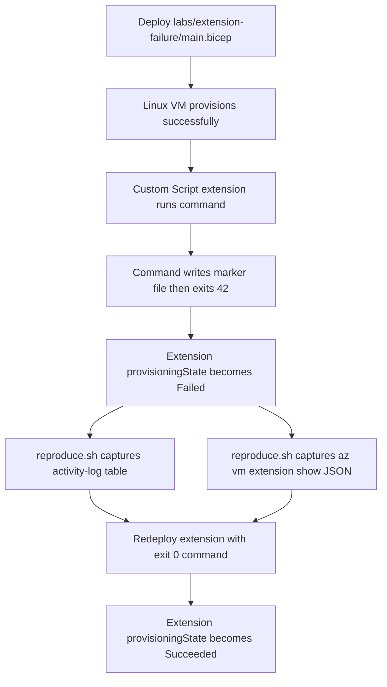

# Extension Failures Lab

Use the `labs/extension-failure/` substrate to force a Linux Custom Script extension into a deterministic `Failed` state, capture the CLI and activity-log evidence, then redeploy the same extension with a non-failing command to prove the issue was the payload rather than the VM itself.

## Lab Metadata

| Attribute | Value |
|---|---|
| Difficulty | Intermediate |
| Estimated Duration | 20-30 minutes once a live Azure run is authorized |
| Platform | Azure Virtual Machines, Linux guest, Custom Script extension |
| Failure Mode | VM provisions successfully but the extension ends in `ProvisioningState=Failed` because the inline command exits `42` |
| Skills Practiced | Distinguishing guest extension failure from VM failure, reading extension instance view, correlating activity log evidence, falsifying with a successful redeploy |

## 1) Background

Azure VM extensions run inside the guest through the Azure VM Agent. That means a provisioning failure on an extension does not automatically mean the virtual machine failed to boot or the control plane failed to create the VM. In this lab substrate, the VM is expected to provision normally while the extension fails intentionally.

The substrate under `labs/extension-failure/` makes that separation explicit:

- `main.bicep` provisions a Linux VM with `provisionVMAgent: true`.
- The `Microsoft.Compute/virtualMachines/extensions` resource uses `Microsoft.Azure.Extensions/CustomScript`.
- The default `extensionCommandToExecute` writes `/tmp/extension-failure-marker.txt` and then exits with status `42`.
- `scripts/reproduce.sh` captures the baseline `az vm extension show` payload plus recent activity-log entries into `labs/extension-failure/evidence/`.

<!-- diagram-id: extension-failures-lab-flow -->


This design isolates hypothesis **H4: extension payload fault** from the paired playbook's broader causes such as VM agent health, outbound connectivity, or OS support mismatch.

## 2) Hypothesis

**IF** the lab deploys the substrate exactly as authored in `labs/extension-failure/main.bicep`, **THEN** the VM should reach a healthy created state while the Custom Script extension alone fails because its inline shell command exits with a non-zero status.

Expected pre-fix behavior:

- The extension's top-level `provisioningState` reports `Failed`.
- `instanceView.statuses` includes a Custom Script execution failure rather than a generic VM allocation failure.
- The activity log shows a failed write/update operation for the extension resource under the VM.
- The failure is falsifiable: redeploying the same template with a command that exits `0` should flip the extension state to `Succeeded` without rebuilding the rest of the diagnosis story.

## 3) Runbook

### Deploy the failing substrate

```bash
export RG="rg-vm-extension-failure"
export LOCATION="koreacentral"
export VM_NAME="vmextlab-vm"
export EXTENSION_NAME="failingCustomScript"

az group create --name "$RG" --location "$LOCATION"

az deployment group create \
    --resource-group "$RG" \
    --template-file labs/extension-failure/main.bicep \
    --parameters @labs/extension-failure/parameters.json \
    --parameters location="$LOCATION" vmName="$VM_NAME" extensionName="$EXTENSION_NAME" adminPassword="<temporary-lab-password>"
```
| Command | Purpose |
| --- | --- |
| `az group create` | Create the resource group that scopes the lab substrate. |
| `--name` | Set the resource group name. |
| `--location` | Set the Azure region for the resource group. |
| `az deployment group create` | Deploy the Bicep template that creates the VM, networking resources, and failing Custom Script extension. |
| `--resource-group` | Target the resource group that receives the deployment. |
| `--template-file` | Point Azure CLI at `labs/extension-failure/main.bicep`. |
| `--parameters` | Supply the parameter file and override the location, VM name, extension name, and temporary lab password. |

Expected result: the VM resource is created, but the overall deployment surfaces an extension failure because `extensionCommandToExecute` ends with `exit 42`.

### Reproduce and capture the failure

```bash
export RG="rg-vm-extension-failure"
export VM_NAME="vmextlab-vm"
export EXTENSION_NAME="failingCustomScript"

bash labs/extension-failure/scripts/reproduce.sh
```
| Command | Purpose |
| --- | --- |
| `bash labs/extension-failure/scripts/reproduce.sh` | Capture the live baseline extension payload and recent activity-log entries into `labs/extension-failure/evidence/`. |

The script writes these real artifacts during a live run:

- `labs/extension-failure/evidence/az-vm-extension-show.json`
- `labs/extension-failure/evidence/activity-log.txt`

### Apply the fix by redeploying a successful command

```bash
az deployment group create \
    --resource-group "$RG" \
    --template-file labs/extension-failure/main.bicep \
    --parameters @labs/extension-failure/parameters.json \
    --parameters location="$LOCATION" vmName="$VM_NAME" extensionName="$EXTENSION_NAME" adminPassword="<temporary-lab-password>" \
    --parameters extensionCommandToExecute='bash -c "echo extension-recovered > /tmp/extension-failure-marker.txt; exit 0"'
```
| Command | Purpose |
| --- | --- |
| `az deployment group create` | Re-run the same Bicep template so the only meaningful behavioral change is the extension command. |
| `--resource-group` | Target the existing lab resource group. |
| `--template-file` | Reuse `labs/extension-failure/main.bicep` for a like-for-like redeploy. |
| `--parameters` | Reapply the original parameters while overriding `extensionCommandToExecute` with a command that exits successfully. |

This keeps the experiment falsifiable: the platform path, VM agent, and resource model stay the same, while the extension payload changes from deterministic failure to deterministic success.

### Re-run the capture after the fix

```bash
bash labs/extension-failure/scripts/reproduce.sh
```
| Command | Purpose |
| --- | --- |
| `bash labs/extension-failure/scripts/reproduce.sh` | Re-capture the extension state and activity log after the successful redeploy so the before/after comparison uses the same collection path. |

## 4) Experiment Log

This authoring PR documents the experiment structure only. No live Azure deployment was performed for this change.

### Substrate facts confirmed from repository source [Observed]

- `main.bicep` provisions a Linux VM, enables the VM agent, and attaches a `Microsoft.Azure.Extensions/CustomScript` extension.
- The default command is `bash -c "echo intentional-extension-failure > /tmp/extension-failure-marker.txt; exit 42"`.
- `scripts/reproduce.sh` captures baseline `az vm extension show` output and recent extension-scoped activity-log entries.
- `scripts/cleanup.sh` deletes the resource group with `az group delete --name "$RG" --yes --no-wait`.

### Pre-fix live evidence to confirm during the first real run [Not Proven]

- `az-vm-extension-show.json` should show the extension in `Failed` state.
- The lab's documented `az vm extension show --instance-view` verification command should expose `instanceView.statuses` with a script-execution failure rather than a VM boot failure.
- `activity-log.txt` should show the extension resource write as failed during the reproduction window.

### Post-fix falsification target [Not Proven]

- After redeploying with `exit 0`, the same extension name should report `Succeeded`.
- The before/after comparison should show that changing the payload alone clears the failure.
- If the extension still fails after the `exit 0` redeploy, the original hypothesis is weakened and the operator should pivot back to the paired playbook's competing hypotheses: VM agent health, outbound connectivity, supported OS, or extension handler mismatch.

## 5) Verification Queries

This substrate does not provision Log Analytics, so the authoritative verification path for Variant A is Azure CLI plus the Azure Activity Log rather than KQL.

### Query the extension state before and after the fix

```bash
az vm extension show \
    --resource-group "$RG" \
    --vm-name "$VM_NAME" \
    --name "$EXTENSION_NAME" \
    --instance-view \
    --query "{provisioningState:provisioningState,statuses:instanceView.statuses[].displayStatus,messages:instanceView.statuses[].message}" \
    --output json
```
| Command | Purpose |
| --- | --- |
| `az vm extension show` | Read the current control-plane and guest-reported status for the extension instance. |
| `--resource-group` | Scope the query to the lab resource group. |
| `--vm-name` | Target the lab virtual machine. |
| `--name` | Target the failing or recovered extension resource. |
| `--instance-view` | Request the guest-reported instance-view block so `instanceView.statuses` is populated for pass/fail evidence. |
| `--query` | Reduce the payload to the fields that distinguish failure from recovery. |
| `--output` | Return machine-readable JSON for evidence capture. |

Pass/fail rule:

- **Pre-fix pass**: `provisioningState` is `Failed`, and the status/messages indicate the Custom Script command failed.
- **Post-fix pass**: `provisioningState` becomes `Succeeded`, and the error-oriented status/message disappears.
- **Fail**: both runs show the same terminal state, which means the payload change did not falsify the original failure mode.

### Query the activity log for the extension operation

```bash
export SUBSCRIPTION_ID="$(az account show --query id --output tsv)"

az monitor activity-log list \
    --resource-group "$RG" \
    --resource-id "/subscriptions/$SUBSCRIPTION_ID/resourceGroups/$RG/providers/Microsoft.Compute/virtualMachines/$VM_NAME/extensions/$EXTENSION_NAME" \
    --offset 2h \
    --max-events 20 \
    --output table
```
| Command | Purpose |
| --- | --- |
| `az account show` | Read the active subscription ID so the extension resource ID can be constructed accurately. |
| `--query` | Return only the subscription ID field. |
| `--output` | Emit a plain TSV value suitable for the shell variable. |
| `az monitor activity-log list` | Query recent Activity Log records for the extension resource. |
| `--resource-group` | Limit the query to the lab resource group. |
| `--resource-id` | Filter to the exact VM extension resource path. |
| `--offset` | Restrict the search window to the recent experiment period. |
| `--max-events` | Cap the result set for focused evidence capture. |
| `--output` | Render a readable evidence table. |

Falsification after fix:

- The pre-fix run should include a failed extension operation in the captured window.
- The post-fix run should add a later successful extension operation for the same resource.
- Numeric counts, timestamps, and exact messages are intentionally pending a real lab run and must not be pre-filled in this authoring-only change.

## 6) Portal Evidence

!!! note "Pending live capture"
    Portal screenshots are intentionally deferred for this authoring-only PR. Do not add image references until the screenshots exist on disk and have been visually verified for caption accuracy and PII safety.

When the first live run happens, capture the evidence into `docs/assets/troubleshooting/extension-failures/` and then add the markdown references in a follow-up change.

Recommended capture set:

1. **VM Extensions blade — failed state**
    - Purpose: show that the VM exists but the Custom Script extension is failed.
    - Look for: extension name, `Failed` provisioning state, and failure-oriented status text.
2. **Extension details / instance view — failure details**
    - Purpose: show the extension-specific error surface rather than a generic VM failure.
    - Look for: status entries or substatus text tied to Custom Script execution.
3. **Activity Log — failed extension write**
    - Purpose: correlate the control-plane failure with the extension resource operation.
    - Look for: failed operation against `Microsoft.Compute/virtualMachines/extensions`.
4. **VM Extensions blade or details — post-fix success**
    - Purpose: falsify the original hypothesis by showing the same extension succeeds after the payload change.
    - Look for: `Succeeded` state on the post-fix capture.

[Not Proven] No screenshot files exist yet in this repository for this lab, so the Portal evidence remains a capture plan rather than completed evidence.

## Clean Up

```bash
export RG="rg-vm-extension-failure"

bash labs/extension-failure/scripts/cleanup.sh
```
| Command | Purpose |
| --- | --- |
| `bash labs/extension-failure/scripts/cleanup.sh` | Run the substrate teardown helper, which calls `az group delete --name "$RG" --yes --no-wait`. |

If you need to delete the group directly instead of using the helper, run `az group delete --name "$RG" --yes --no-wait` from the repository root.

## Related Playbook

- [Extension Failures](../playbooks/connectivity/extension-failures.md)

Use the playbook when the lab's controlled `exit 42` payload is **not** enough to explain the live symptom. The playbook broadens the investigation to VM agent health, outbound access, supported images, and extension-handler compatibility.

## See Also

- [Lab Guides](index.md)
- [Troubleshooting](../index.md)
- [Connectivity Checklist](../first-10-minutes/connectivity.md)
- [Extension Failures playbook](../playbooks/connectivity/extension-failures.md)

## Sources

- [Azure VM extensions and features](https://learn.microsoft.com/en-us/azure/virtual-machines/extensions/overview)
- [Custom Script Extension for Linux virtual machines](https://learn.microsoft.com/en-us/azure/virtual-machines/extensions/custom-script-linux)
- [Troubleshoot Azure VM extension failures](https://learn.microsoft.com/en-us/azure/virtual-machines/extensions/troubleshoot)
