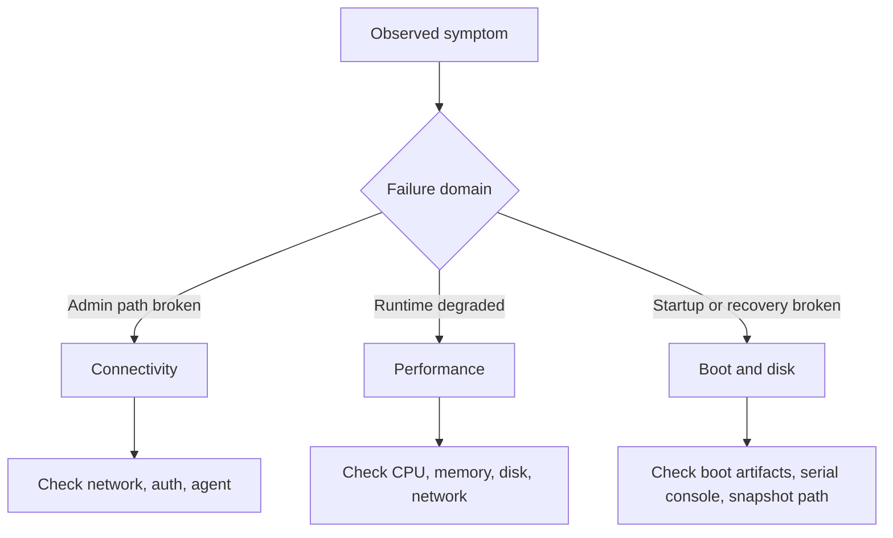
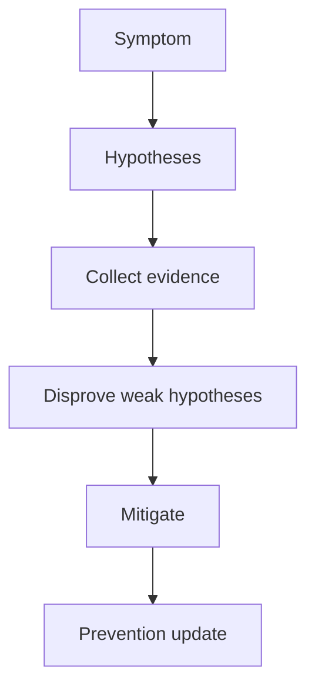

---
content_sources:
  diagrams:
  - id: troubleshooting-mental-model-classification-model
    type: flowchart
    source: self-generated
    description: Classification model
    based_on:
    - https://learn.microsoft.com/en-us/troubleshoot/azure/virtual-machines/welcome-virtual-machines
    - https://learn.microsoft.com/en-us/azure/virtual-machines/troubleshooting/
    justification: Synthesized for this guide from the referenced Microsoft Learn
      documentation.
  - id: troubleshooting-mental-model-investigation-rhythm
    type: flowchart
    source: self-generated
    description: Investigation rhythm
    based_on:
    - https://learn.microsoft.com/en-us/troubleshoot/azure/virtual-machines/welcome-virtual-machines
    - https://learn.microsoft.com/en-us/azure/virtual-machines/troubleshooting/
    justification: Synthesized for this guide from the referenced Microsoft Learn
      documentation.
---

# VM Troubleshooting Mental Model

The core VM troubleshooting habit is simple: classify the failure domain first, then collect disproving evidence before committing to a root cause.

## Classification model

<!-- diagram-id: troubleshooting-mental-model-classification-model -->

## Four rules

1. **Start with the narrowest true symptom**: “cannot SSH” is better than “VM is broken.”
2. **Use competing hypotheses**: at least two plausible explanations before taking action.
3. **Prefer disproof over confirmation**: look for evidence that would invalidate your favorite theory.
4. **Separate platform from guest**: Azure state and guest state are not the same thing.

## Typical category mistakes

| Mistake | What it causes | Better move |
|---|---|---|
| treating every access failure as an NSG issue | misses guest firewall, VM agent, or credential problems | check network path and guest readiness together |
| using only CPU for performance diagnosis | misses memory pressure and disk throttling | inspect CPU, memory, disk, and queue/latency together |
| trying RDP/SSH fixes during boot corruption | wastes time on a path that cannot work yet | switch immediately to Boot Diagnostics and Serial Console |
| retrying backup without checking agent state | repeats the same failed snapshot workflow | validate VM agent and extension health first |

## Investigation rhythm

<!-- diagram-id: troubleshooting-mental-model-investigation-rhythm -->

## How to apply this in practice

- Use [Quick Diagnosis Cards](quick-diagnosis-cards.md) when speed matters.
- Use the matching [First 10 Minutes](first-10-minutes/index.md) checklist to stabilize routing.
- Open one canonical playbook and finish the evidence loop before jumping categories.

## See Also

- [Architecture Overview](architecture-overview.md)
- [Decision Tree](decision-tree.md)
- [Evidence Map](evidence-map.md)
- [Quick Diagnosis Cards](quick-diagnosis-cards.md)

## Sources

- [Troubleshoot Azure virtual machines](https://learn.microsoft.com/en-us/troubleshoot/azure/virtual-machines/welcome-virtual-machines)
- [Troubleshooting Azure virtual machines in Azure portal](https://learn.microsoft.com/en-us/azure/virtual-machines/troubleshooting/)
