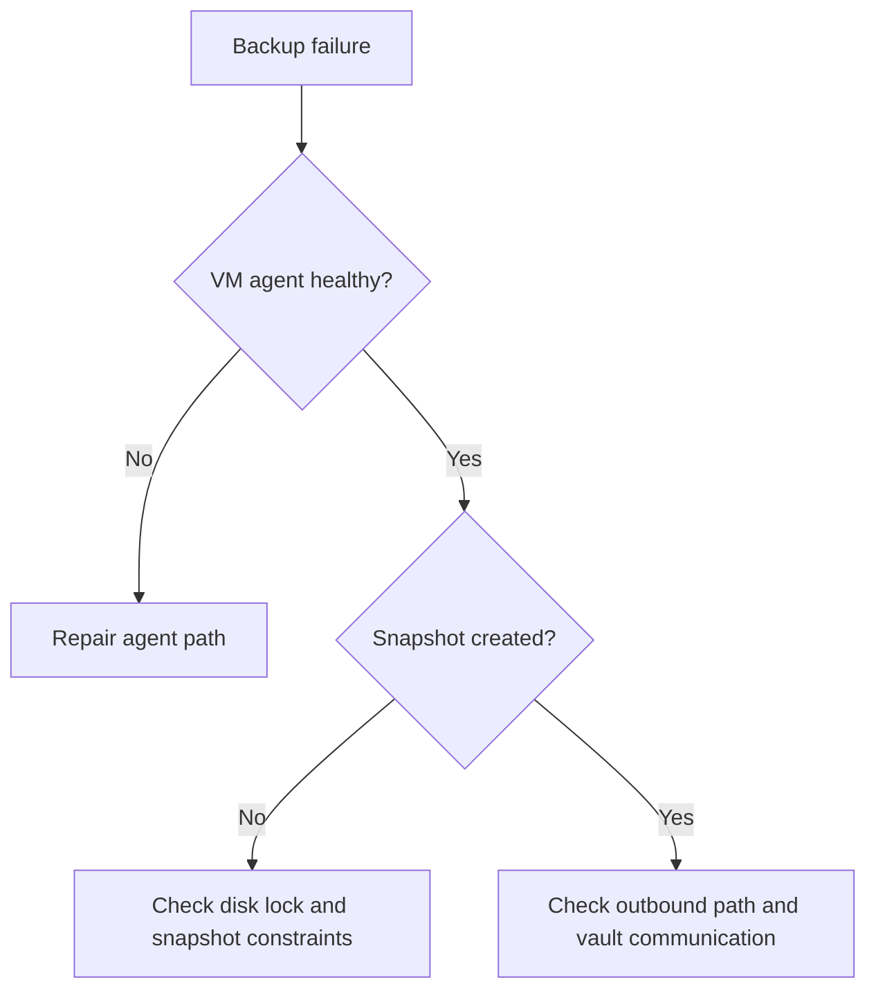

---
content_sources:
  diagrams:
  - id: troubleshooting-playbooks-boot-disk-backup-failures-troubleshooting-decision-flow
    type: flowchart
    source: self-generated
    description: Troubleshooting decision flow
    based_on:
    - https://learn.microsoft.com/en-us/azure/backup/backup-azure-vms-troubleshoot
    - https://learn.microsoft.com/en-us/azure/backup/backup-azure-troubleshoot-vm-backup-fails-snapshot-timeout
    - https://learn.microsoft.com/en-us/azure/backup/backup-support-matrix-iaas
    justification: Synthesized for this guide from the referenced Microsoft Learn
      documentation.
---

# Backup Failures

## 1. Summary

### Symptom
Azure Backup jobs fail for the VM, often with snapshot, VM agent, or communication-related errors.

### Why this scenario is confusing
The failure is reported by Backup, but the root cause may live in the VM agent, VMSnapshot extension, disk lock state, or outbound communication path.

### Troubleshooting decision flow
<!-- diagram-id: troubleshooting-playbooks-boot-disk-backup-failures-troubleshooting-decision-flow -->

## 2. Common Misreadings

- "Backup failed, so restore must be broken too."
- "Retry is enough without reading the error code."
- "This is only a vault-side issue."

## 3. Competing Hypotheses

- **H1: VM agent or VMSnapshot extension unhealthy**.
- **H2: Snapshot blocked by disk state or resource locks**.
- **H3: Outbound communication to backup services blocked**.
- **H4: Backup policy or snapshot-limit issue**.

## 4. What to Check First

- Exact backup error code.
- VM agent ready state and extension health.
- Disk lock state and snapshot count.
- Required network path over port 443.

## 5. Evidence to Collect

- Backup job details and timestamps.
- VMSnapshot or extension logs.
- Resource locks on VM, RG, and disks.
- Any connectivity restriction between VM and vault endpoints.

## 6. Validation and Disproof by Hypothesis

### H1: Agent or extension unhealthy
- **Supports**: `UserErrorVmNotReady`, extension not responding, multiple agent-based actions failing.
- **Weakens**: agent healthy and snapshot creation proceeds.

### H2: Snapshot blocked
- **Supports**: disk lock, consistency issue, snapshot limit reached.
- **Weakens**: snapshot succeeds and failure occurs later.

### H3: Outbound communication blocked
- **Supports**: connectivity failure after snapshot stage.
- **Weakens**: network path healthy and vault exchange succeeds.

### H4: Policy or platform limit issue
- **Supports**: policy mismatch, unsupported config, snapshot quota condition.
- **Weakens**: same policy works on identical peers.

## 7. Likely Root Cause Patterns

- VM agent stale or unhealthy.
- VMSnapshot extension timeout during busy disk window.
- Resource lock blocks snapshot operations.
- NSG/firewall change breaks outbound backup communication.

## 8. Immediate Mitigations

- Restore VM agent health before retrying backup.
- Remove blocking resource locks if approved.
- Fix required outbound access and then re-run pre-checks.
- Reduce snapshot sprawl or correct backup policy mismatch.

## 9. Prevention

- Monitor backup pre-check and VM agent health continuously.
- Keep documented outbound requirements for protected subnets.
- Periodically test backup and restore paths, not backup only.

## See Also

- [Boot Checklist](../../first-10-minutes/boot.md)
- [Extension Failures](../connectivity/extension-failures.md)
- [Backup and Restore](../../../operations/backup-restore.md)

## Sources

- [Troubleshoot Azure VM backup failures](https://learn.microsoft.com/en-us/azure/backup/backup-azure-vms-troubleshoot)
- [Troubleshoot VM backup snapshot timeout failures](https://learn.microsoft.com/en-us/azure/backup/backup-azure-troubleshoot-vm-backup-fails-snapshot-timeout)
- [Support matrix for Azure VM backup](https://learn.microsoft.com/en-us/azure/backup/backup-support-matrix-iaas)
