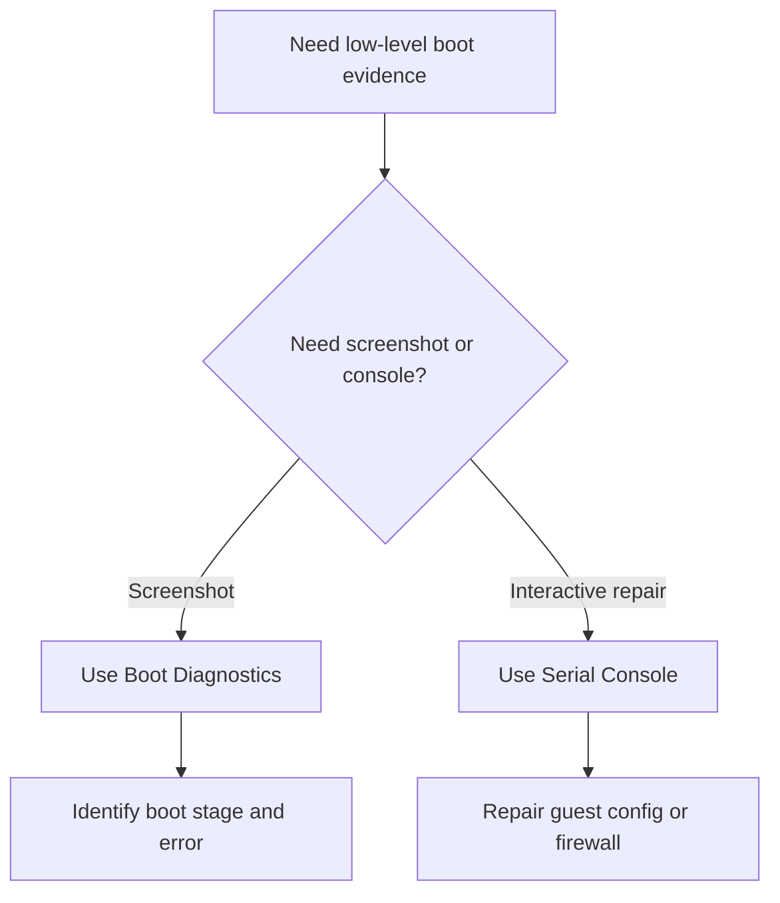

# Boot Diagnostics and Serial Console

## 1. Summary

### Symptom
Normal network-based administration is unavailable and you need low-level visibility into the VM boot path or guest repair actions.

### Why this scenario is confusing
Engineers often keep retrying RDP or SSH even though the only useful evidence now exists in Boot Diagnostics or the Serial Console.

### Troubleshooting decision flow

## 2. Common Misreadings

- "Serial Console is only for Linux."
- "Blank screen means the tool is broken."
- "Boot Diagnostics replaces guest logs completely."

## 3. Competing Hypotheses

- **H1: Guest boot is failing before network comes up**.
- **H2: Guest boot completed, but admin path is blocked**.
- **H3: Azure-side event, not guest-side, is primary**.

## 4. What to Check First

- Whether Boot Diagnostics is enabled.
- Latest screenshot and serial output.
- Whether Activity Log already points to an Azure-side failure.
- Whether a local guest repair action is actually required.

## 5. Evidence to Collect

- Screenshot showing blue screen, kernel panic, login prompt, or hang point.
- Serial Console output and commands run.
- Required permissions for serial access.
- Any correlated Activity Log events.

## 6. Validation and Disproof by Hypothesis

### H1: Boot failure before network
- **Supports**: panic, bootloader error, no login prompt.
- **Weakens**: screenshot shows normal login prompt.

### H2: Boot complete but admin path blocked
- **Supports**: login prompt visible, but RDP/SSH still unreachable.
- **Weakens**: system never reaches prompt.

### H3: Azure-side event primary
- **Supports**: Activity Log shows allocation or platform issue before guest stage.
- **Weakens**: guest-level failure clearly visible in screenshot or serial log.

## 7. Likely Root Cause Patterns

- Bootloader or kernel failure visible before login.
- Guest firewall blocks admin ports after successful boot.
- VM contributor lacks serial console rights and loses recovery time.

## 8. Immediate Mitigations

- Switch immediately to Boot Diagnostics when VM is unreachable during startup.
- Use Serial Console to repair firewall, bootloader, or login path.
- Escalate to Azure-side investigation only after guest evidence is exhausted.

## 9. Prevention

- Keep Boot Diagnostics enabled by policy.
- Ensure recovery operators have required Serial Console permissions.
- Document standard serial-console repair steps for Windows and Linux.

## See Also

- [Boot Checklist](../../first-10-minutes/boot.md)
- [VM Won't Start](vm-wont-start.md)
- [Cannot RDP or SSH](../connectivity/cannot-rdp-or-ssh.md)

## Sources

- [How to use Azure boot diagnostics](https://learn.microsoft.com/en-us/azure/virtual-machines/boot-diagnostics)
- [Azure Serial Console for Windows](https://learn.microsoft.com/en-us/troubleshoot/azure/virtual-machines/serial-console-windows)
- [Azure Serial Console for Linux](https://learn.microsoft.com/en-us/troubleshoot/azure/virtual-machines/serial-console-linux)
