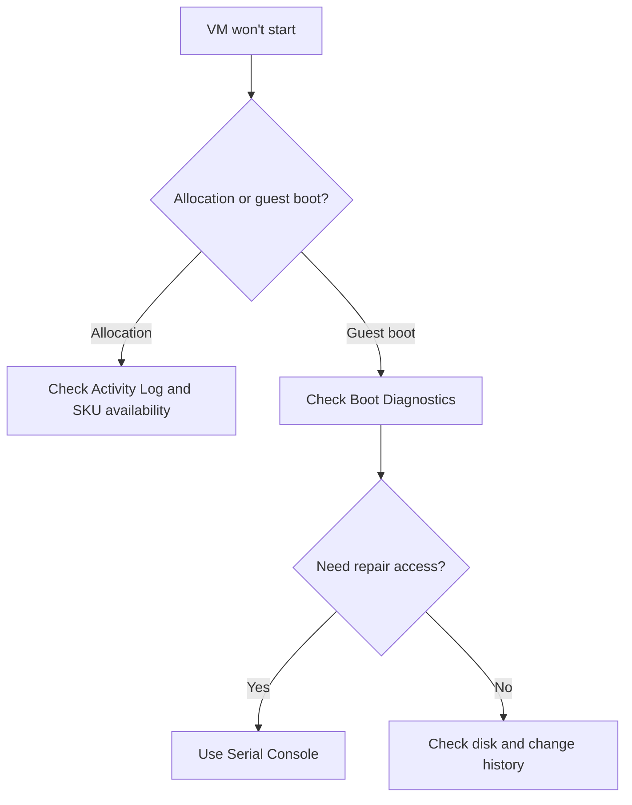

---
hide:
  - toc
---

# VM Won't Start

## 1. Summary

### Symptom
The VM fails to enter a healthy running state, remains stuck at start, or repeatedly fails early in boot.

### Why this scenario is confusing
The same symptom can be caused by Azure allocation limits, guest boot corruption, disk attachment problems, or post-update OS failures.

### Troubleshooting decision flow

## 2. Common Misreadings

- "Start failed means the OS disk is corrupt."
- "Repeated restart attempts will eventually fix it."
- "If the portal says running, boot is complete."

## 3. Competing Hypotheses

- **H1: Allocation or capacity failure**.
- **H2: Guest OS boot corruption**.
- **H3: Disk attachment or configuration issue**.
- **H4: Recent update or driver regression**.

## 4. What to Check First

- Activity Log error category.
- Boot Diagnostics screenshot.
- Recent resize, patch, kernel, or driver change.
- OS and data disk attachment state.

## 5. Evidence to Collect

- Exact Azure start error or allocation code.
- Boot screenshot or serial-console output.
- Recent change timeline.
- Any resource or disk locks affecting recovery actions.

## 6. Validation and Disproof by Hypothesis

### H1: Allocation or capacity failure
- **Supports**: SKU/cluster availability errors in Activity Log.
- **Weakens**: guest boot evidence clearly shows OS failure.

### H2: Guest OS boot corruption
- **Supports**: boot loop, kernel panic, BCD or GRUB error.
- **Weakens**: start never reaches guest stage.

### H3: Disk attachment issue
- **Supports**: attachment failure, missing disk, changed LUN or corruption signal.
- **Weakens**: all disk config normal and screenshot shows software error instead.

### H4: Update or driver regression
- **Supports**: incident began immediately after update/change.
- **Weakens**: no change correlation and older image behaves the same.

## 7. Likely Root Cause Patterns

- Resize to an unavailable SKU.
- Bootloader damaged after OS update.
- Data disk state blocks startup sequence.
- Driver or kernel change leaves VM at blue/black screen.

## 8. Immediate Mitigations

- Retry later or choose a different size if allocation failed.
- Repair bootloader from Serial Console.
- Validate and reattach disks if configuration drift exists.
- Restore from backup or known-good snapshot if corruption is confirmed.

## 9. Prevention

- Keep Boot Diagnostics enabled on all VMs.
- Test resize and patch strategy on non-production first.
- Maintain backup and recovery checkpoints for critical systems.

## See Also

- [Boot Checklist](../../first-10-minutes/boot.md)
- [Boot Diagnostics and Serial Console](boot-diagnostics-and-serial-console.md)
- [Resize and Redeploy](../../../operations/resize-and-redeploy.md)

## Sources

- [Troubleshoot Azure VM boot issues](https://learn.microsoft.com/en-us/troubleshoot/azure/virtual-machines/troubleshoot-vm-boot-error)
- [Allocation failures when you create or resize VMs](https://learn.microsoft.com/en-us/troubleshoot/azure/virtual-machines/allocation-failure)
- [Understand boot diagnostics](https://learn.microsoft.com/en-us/azure/virtual-machines/boot-diagnostics)
