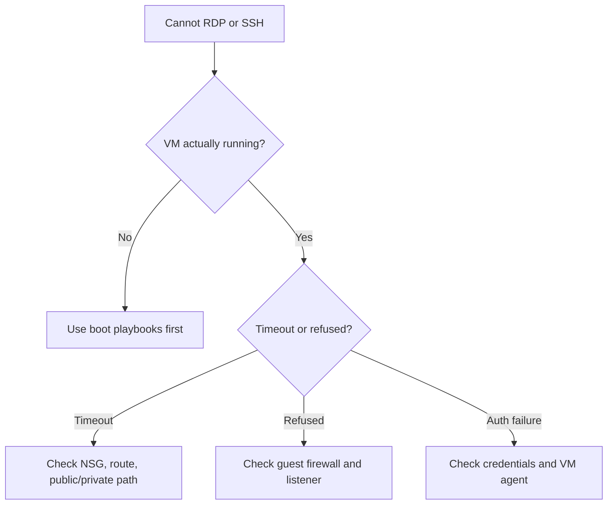

---
hide:
- toc
content_sources:
  diagrams:
  - id: troubleshooting-playbooks-connectivity-cannot-rdp-or-ssh-troubleshooting-decision-flow
    type: flowchart
    source: self-generated
    description: Troubleshooting decision flow
    based_on:
    - https://learn.microsoft.com/en-us/troubleshoot/azure/virtual-machines/troubleshoot-rdp-connection
    - https://learn.microsoft.com/en-us/troubleshoot/azure/virtual-machines/troubleshoot-ssh-connection
    - https://learn.microsoft.com/en-us/azure/bastion/bastion-overview
    justification: Synthesized for this guide from the referenced Microsoft Learn
      documentation.
---

# Cannot RDP or SSH

## 1. Summary

### Symptom
RDP or SSH attempts time out, are refused, or fail after the VM appears to be running.

### Why this scenario is confusing
The same symptom can come from NSG rules, routing, guest firewall, credentials, or a VM that never completed healthy boot.

### Troubleshooting decision flow
<!-- diagram-id: troubleshooting-playbooks-connectivity-cannot-rdp-or-ssh-troubleshooting-decision-flow -->

## 2. Common Misreadings

- "The VM is running, so the network path must be fine."
- "A timeout always means NSG."
- "Resetting credentials fixes all login failures."

## 3. Competing Hypotheses

- **H1: NSG or route path blocks traffic**.
- **H2: Guest firewall or listener is not accepting the connection**.
- **H3: Credentials or key material are wrong**.
- **H4: VM agent or guest health is degraded after boot**.

## 4. What to Check First

- VM power and provisioning state.
- Effective NSG rules and effective routes.
- Guest firewall and service listener state.
- Serial Console or Run Command access path.

## 5. Evidence to Collect

- Exact client error: timeout, refused, or access denied.
- Network Watcher reachability data or effective rules.
- Guest logs or console evidence showing RDP/SSH service status.
- VM agent status if password reset or Run Command is needed.

## 6. Validation and Disproof by Hypothesis

### H1: NSG or route path blocks traffic
- **Supports**: timeout, denied effective security rule, invalid next hop.
- **Weakens**: traffic reaches VM but port is refused.

### H2: Guest firewall or listener issue
- **Supports**: port refused, service stopped, firewall deny.
- **Weakens**: no path to NIC at all.

### H3: Credential issue
- **Supports**: access denied with healthy listener.
- **Weakens**: timeout or refused before auth begins.

### H4: VM agent or guest health degraded
- **Supports**: Run Command, password reset, or extension actions also fail.
- **Weakens**: agent healthy and guest services respond normally.

## 7. Likely Root Cause Patterns

- NSG rule too narrow after IP change.
- Guest firewall allows wrong subnet only.
- RDP/SSH service stopped after update.
- Wrong username, expired password, or stale SSH public key.

## 8. Immediate Mitigations

- Restore least-privilege NSG access or use Bastion.
- Repair guest firewall from Serial Console or Run Command.
- Reset password or SSH key if auth path is the only failure.
- Switch to boot diagnostics if guest never became healthy.

## 9. Prevention

- Prefer Bastion or VPN over exposing management ports.
- Baseline guest firewall and NSG rules in code.
- Keep VM agent healthy and monitor extension state.

## See Also

- [Connectivity Checklist](../../first-10-minutes/connectivity.md)
- [DNS and Connectivity Issues](dns-and-connectivity-issues.md)
- [Connect to VM](../../../operations/connect-to-vm.md)

## Sources

- [Troubleshoot RDP connections to an Azure VM](https://learn.microsoft.com/en-us/troubleshoot/azure/virtual-machines/troubleshoot-rdp-connection)
- [Troubleshoot SSH connections to an Azure Linux VM](https://learn.microsoft.com/en-us/troubleshoot/azure/virtual-machines/troubleshoot-ssh-connection)
- [Azure Bastion documentation](https://learn.microsoft.com/en-us/azure/bastion/bastion-overview)
