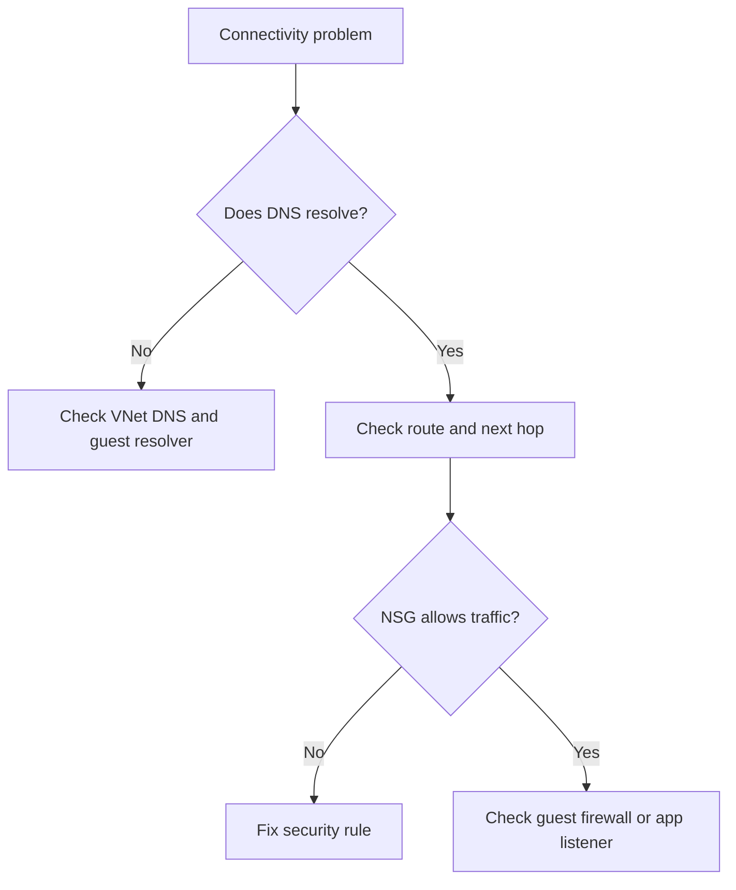

---
content_sources:
  diagrams:
  - id: troubleshooting-playbooks-connectivity-dns-and-connectivity-issues-troubleshooting-decision-flow
    type: flowchart
    source: self-generated
    description: Troubleshooting decision flow
    based_on:
    - https://learn.microsoft.com/en-us/azure/dns/dns-troubleshoot
    - https://learn.microsoft.com/en-us/troubleshoot/azure/virtual-network/virtual-network-troubleshoot-peering-issues
    - https://learn.microsoft.com/en-us/azure/network-watcher/ip-flow-verify-overview
    justification: Synthesized for this guide from the referenced Microsoft Learn
      documentation.
---

# DNS and Connectivity Issues

## 1. Summary

### Symptom
VMs cannot resolve names, reach private endpoints, or communicate across peered or routed network paths.

### Why this scenario is confusing
DNS, NSG, UDR, peering, and guest-firewall problems can all present as the same application timeout.

### Troubleshooting decision flow
<!-- diagram-id: troubleshooting-playbooks-connectivity-dns-and-connectivity-issues-troubleshooting-decision-flow -->

## 2. Common Misreadings

- "Ping works, so the application path is healthy."
- "DNS is fine because one client can resolve it."
- "Peering connected means routes are correct."

## 3. Competing Hypotheses

- **H1: DNS configuration mismatch**.
- **H2: UDR or peering path sends traffic to the wrong hop**.
- **H3: NSG blocks the flow**.
- **H4: Guest firewall or app port is closed**.

## 4. What to Check First

- Failing FQDN or IP and exact source/destination pair.
- Guest `nslookup` or `dig` results.
- Effective routes, next hop, and peering state.
- IP Flow Verify or equivalent NSG evidence.

## 5. Evidence to Collect

- DNS server settings for VNet and guest OS.
- Network Watcher results for next hop and flow verification.
- Effective security rules and route tables.
- Guest firewall status and app port binding.

## 6. Validation and Disproof by Hypothesis

### H1: DNS configuration mismatch
- **Supports**: wrong resolver, stale custom DNS, no response from `168.63.129.16` or custom DNS.
- **Weakens**: name resolves correctly from the affected guest.

### H2: UDR or peering path issue
- **Supports**: next hop unexpected, peering disconnected, overlapping address space.
- **Weakens**: next hop and route are healthy.

### H3: NSG block
- **Supports**: denied flow verification or missing rule.
- **Weakens**: flow allowed and packet reaches host.

### H4: Guest firewall or app closed
- **Supports**: route and NSG healthy, but connection still refused.
- **Weakens**: no path to destination.

## 7. Likely Root Cause Patterns

- Custom DNS server unreachable from the subnet.
- UDR sends traffic to a missing virtual appliance.
- Peering drift after topology change.
- Application listens only on localhost or wrong interface.

## 8. Immediate Mitigations

- Restore working DNS path or correct resolver settings.
- Fix UDR or peering configuration.
- Add precise NSG allow rule.
- Open the guest firewall or correct the listening address.

## 9. Prevention

- Standardize DNS and routing patterns per subnet role.
- Monitor Network Watcher findings for critical paths.
- Document east-west dependency flows and required ports.

## See Also

- [Connectivity Checklist](../../first-10-minutes/connectivity.md)
- [Cannot RDP or SSH](cannot-rdp-or-ssh.md)
- [Networking Components](../../../reference/networking-components.md)

## Sources

- [Troubleshoot DNS resolution issues](https://learn.microsoft.com/en-us/azure/dns/dns-troubleshoot)
- [Troubleshoot virtual network peering issues](https://learn.microsoft.com/en-us/troubleshoot/azure/virtual-network/virtual-network-troubleshoot-peering-issues)
- [IP flow verify overview](https://learn.microsoft.com/en-us/azure/network-watcher/ip-flow-verify-overview)
