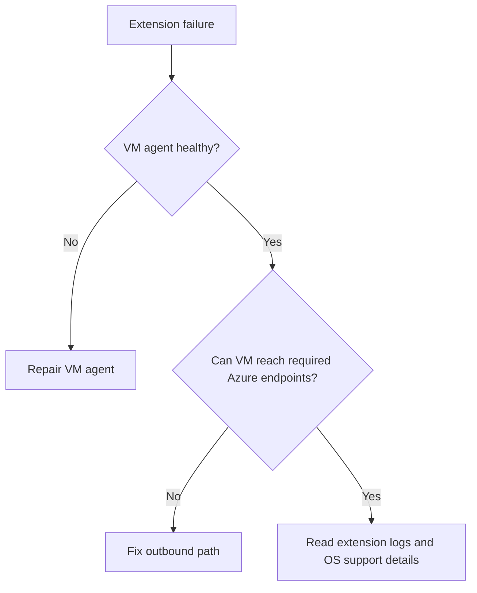

# Extension Failures

## 1. Summary

### Symptom
VM extension installation, update, or execution fails and provisioning state becomes `Failed` or stays `Transitioning` too long.

### Why this scenario is confusing
The visible failure is the extension, but the real cause is often the VM agent, outbound connectivity, OS support, or the extension payload itself.

### Troubleshooting decision flow

## 2. Common Misreadings

- "Reinstalling the extension always fixes it."
- "Provisioning failed means the VM itself is down."
- "Any extension log error is an application error."

## 3. Competing Hypotheses

- **H1: VM agent unhealthy or outdated**.
- **H2: Outbound connectivity to Azure endpoints is blocked**.
- **H3: Unsupported OS/kernel or extension version mismatch**.
- **H4: Extension payload or script logic is faulty**.

## 4. What to Check First

- VM agent ready state.
- Extension provisioning state and substatus.
- Extension-specific log path.
- Required outbound access including `168.63.129.16` and Azure service endpoints.

## 5. Evidence to Collect

- Instance view showing agent and extension states.
- Extension logs from the guest.
- OS version, kernel version, and supported matrix.
- Any script timeout, access denied, or dependency error.

## 6. Validation and Disproof by Hypothesis

### H1: VM agent unhealthy
- **Supports**: multiple extensions fail, agent not ready, Run Command problems.
- **Weakens**: agent healthy and only one extension fails.

### H2: Outbound path blocked
- **Supports**: downloads/timeouts to Azure endpoints fail.
- **Weakens**: outbound path healthy and logs show local script error.

### H3: Unsupported OS/kernel mismatch
- **Supports**: dependency or kernel mismatch in logs.
- **Weakens**: supported platform with identical success on peer VMs.

### H4: Extension payload fault
- **Supports**: script syntax, permissions, or bad parameter errors.
- **Weakens**: generic platform or transport failures before payload starts.

## 7. Likely Root Cause Patterns

- VM agent stalled after patching.
- NSG or firewall blocks extension downloads.
- Old OS image not supported by the extension version.
- Custom Script Extension points to inaccessible content.

## 8. Immediate Mitigations

- Restore VM agent health first.
- Fix outbound security path.
- Re-run extension only after collecting logs.
- Roll back to supported extension or OS combination.

## 9. Prevention

- Monitor VM agent readiness and extension drift.
- Keep baseline outbound requirements documented.
- Standardize supported images for extension-dependent workloads.

## See Also

- [Connectivity Checklist](../../first-10-minutes/connectivity.md)
- [Backup Failures](../boot-disk/backup-failures.md)
- [Monitoring and Alerting](../../../operations/monitoring-and-alerting.md)

## Sources

- [Troubleshoot Azure VM extension failures](https://learn.microsoft.com/en-us/azure/virtual-machines/extensions/troubleshoot)
- [Azure Monitor Agent troubleshooting](https://learn.microsoft.com/en-us/azure/azure-monitor/agents/troubleshoot-agent-windows)
- [Custom Script Extension for Windows](https://learn.microsoft.com/en-us/azure/virtual-machines/extensions/custom-script-windows)
