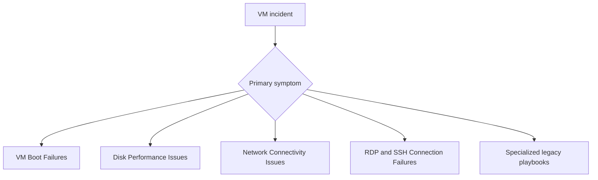

---
hide:
  - toc
---

# Playbooks

These are the canonical VM troubleshooting playbooks. Use the root playbooks first when you need scenario-driven guidance for the most common production failures, then branch into the nested library for older or more specialized flows.

## Diagnostic Entry Map

## Recommended First-Line Playbooks

| Playbook | When to use it |
|---|---|
| [VM Boot Failures](vm-boot-failures.md) | The VM does not complete boot or never becomes remotely usable. |
| [Disk Performance Issues](disk-performance-issues.md) | Latency, queue depth, or throughput bottlenecks affect the workload. |
| [Network Connectivity Issues](network-connectivity-issues.md) | East-west, north-south, or dependency traffic fails after network changes. |
| [RDP and SSH Connection Failures](rdp-ssh-connection-failures.md) | Administrative sign-in or Bastion-based access fails. |
| [Boot Diagnostics and Serial Console](boot-disk/boot-diagnostics-and-serial-console.md) | You need low-level evidence or recovery access after boot failure. |

## Legacy / Specialized Playbooks

### Connectivity

- [Cannot RDP or SSH](connectivity/cannot-rdp-or-ssh.md)
- [DNS and Connectivity Issues](connectivity/dns-and-connectivity-issues.md)
- [Extension Failures](connectivity/extension-failures.md)

### Performance

- [Slow Performance](performance/slow-performance.md)
- [High CPU / Memory / Disk](performance/high-cpu-memory-disk.md)
- [Nested Disk Performance Playbook](performance/disk-performance-issues.md)

### Boot and Disk

- [VM Won't Start](boot-disk/vm-wont-start.md)
- [Boot Diagnostics and Serial Console](boot-disk/boot-diagnostics-and-serial-console.md)
- [Backup Failures](boot-disk/backup-failures.md)

## See Also

- [Troubleshooting](../index.md)
- [First 10 Minutes](../first-10-minutes/index.md)
- [Decision Tree](../decision-tree.md)

## Sources

- [Troubleshoot Azure virtual machines](https://learn.microsoft.com/en-us/troubleshoot/azure/virtual-machines/welcome-virtual-machines)
