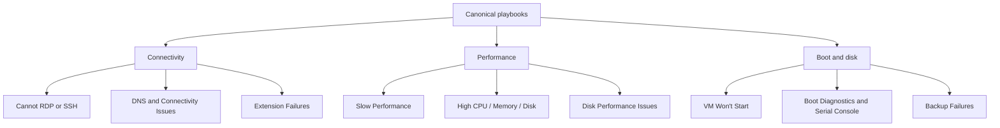

# Playbooks

These are the canonical VM troubleshooting playbooks. Each one follows the same structure: summary, competing hypotheses, evidence, validation, mitigations, and prevention.

## Playbook map

## Connectivity

| Playbook | Symptom |
|---|---|
| [Cannot RDP or SSH](connectivity/cannot-rdp-or-ssh.md) | Administrative connection timeout, refusal, or auth failure |
| [DNS and Connectivity Issues](connectivity/dns-and-connectivity-issues.md) | Name resolution failure, route issue, or blocked east-west traffic |
| [Extension Failures](connectivity/extension-failures.md) | VM extension or agent-driven action failed |

## Performance

| Playbook | Symptom |
|---|---|
| [Slow Performance](performance/slow-performance.md) | General slowness with uncertain bottleneck |
| [High CPU / Memory / Disk](performance/high-cpu-memory-disk.md) | One resource is clearly exhausted or near exhaustion |
| [Disk Performance Issues](performance/disk-performance-issues.md) | Disk latency, queue, IOPS, or throughput bottleneck |

## Boot and disk

| Playbook | Symptom |
|---|---|
| [VM Won't Start](boot-disk/vm-wont-start.md) | VM fails to power on or finish boot |
| [Boot Diagnostics and Serial Console](boot-disk/boot-diagnostics-and-serial-console.md) | Need low-level boot evidence and console recovery |
| [Backup Failures](boot-disk/backup-failures.md) | Azure Backup or snapshot-based protection failed |

## See Also

- [Troubleshooting](../index.md)
- [First 10 Minutes](../first-10-minutes/index.md)
- [Decision Tree](../decision-tree.md)

## Sources

- [Troubleshoot Azure virtual machines](https://learn.microsoft.com/en-us/troubleshoot/azure/virtual-machines/welcome-virtual-machines)
