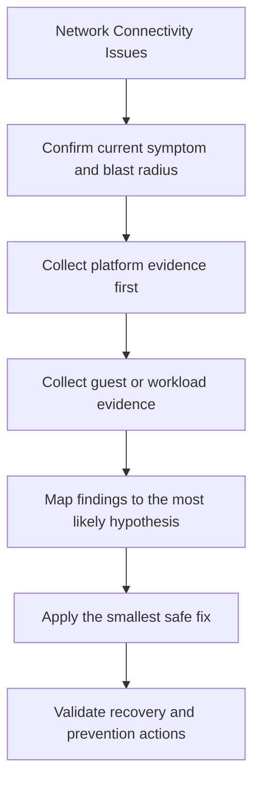

---
content_sources:
  diagrams:
  - id: troubleshooting-playbooks-network-connectivity-issues-symptoms
    type: flowchart
    source: self-generated
    description: Symptoms
    based_on:
    - https://learn.microsoft.com/en-us/troubleshoot/azure/virtual-machines/welcome-virtual-machines
    - https://learn.microsoft.com/en-us/azure/virtual-machines/boot-diagnostics
    - https://learn.microsoft.com/en-us/azure/bastion/bastion-connect-vm-rdp-windows
    - https://learn.microsoft.com/en-us/azure/virtual-machines/disks-performance
    - https://learn.microsoft.com/en-us/azure/virtual-network/accelerated-networking-overview
    justification: Synthesized for this guide from the referenced Microsoft Learn
      documentation.
---

# Network Connectivity Issues

## Symptoms

- Administrative or workload impact is visible to users or operators.
- The VM is deployed, but one part of the expected control plane or data path is failing.
- You need a fast way to narrow the problem before making a risky change.

<!-- diagram-id: troubleshooting-playbooks-network-connectivity-issues-symptoms -->


## 1. Summary

Use this playbook when a VM cannot reach internal or external endpoints, dependencies time out, or east-west communication breaks after NSG, NIC, route, or DNS changes.

NIC effective configuration, NSG and route review, DNS, accelerated networking, and dependency reachability.

## 2. Common Misreadings

| Observation | Often misread as | Actually means |
|---|---|---|
| One failed probe or one stale metric | Total VM outage | The issue may be scoped to one path or one recovery dependency. |
| A successful extension deployment | Guest health is good | Extensions can succeed while the underlying guest service still fails. |
| A recent change record | Guaranteed root cause | Recent changes are strong leads, but they still need proof from evidence. |
| A restart fixes the issue | Permanent resolution | Recovery after restart may only hide the real structural cause. |

## 3. Competing Hypotheses

| Hypothesis | Likelihood | Key discriminator |
|---|---|---|
| Control-plane or configuration drift | High | Azure resource state no longer matches the intended pattern. |
| Guest OS or agent issue | High | Guest or serial evidence shows service, boot, or firewall failure. |
| Capacity or platform dependency bottleneck | Medium | Metrics or SKU limits explain the symptom better than configuration drift. |
| Security control blocked expected behavior | Medium | NSG, ASG, JIT, or policy state changed before the incident. |
| External dependency issue | Low | VM appears healthy, but a downstream service path is broken. |

## 4. What to Check First

1. **Review VM instance view**

    ```bash
    az vm get-instance-view             --resource-group $RG             --name $VM_NAME             --output json
    ```

| Command | Purpose |
| --- | --- |
| `az vm get-instance-view` | Retrieve the runtime instance view of the virtual machine. |
| `--resource-group` | Resource group that contains the virtual machine. |
| `--name` | Name of the virtual machine to inspect. |
| `--output` | Output format for the response (JSON here). |

2. **Review boot diagnostics settings**

    ```bash
    az vm boot-diagnostics get-boot-log             --resource-group $RG             --name $VM_NAME
    ```

| Command | Purpose |
| --- | --- |
| `az vm boot-diagnostics get-boot-log` | Retrieve the serial boot log for the virtual machine. |
| `--resource-group` | Resource group that contains the virtual machine. |
| `--name` | Name of the virtual machine to inspect. |

3. **Review NIC effective security rules**

    ```bash
    az network nic list-effective-nsg             --resource-group $RG             --name $NIC_NAME             --output json
    ```

| Command | Purpose |
| --- | --- |
| `az network nic list-effective-nsg` | List the effective NSG rules applied to a network interface. |
| `--resource-group` | Resource group that contains the network interface. |
| `--name` | Name of the network interface to inspect. |
| `--output` | Output format for the response (JSON here). |

4. **Review recent platform changes**

    ```bash
    az monitor activity-log list             --resource-group $RG             --offset 24h             --output table
    ```

| Command | Purpose |
| --- | --- |
| `az monitor activity-log list` | List recent control-plane activity-log events. |
| `--resource-group` | Resource group to scope activity-log events to. |
| `--offset` | Look-back window for events (24h here). |
| `--output` | Output format for the response (table here). |

## 5. Evidence to Collect

### 5.1 KQL Queries

```kusto
// NSG flow or denied connection signals
AzureDiagnostics
| where TimeGenerated > ago(6h)
| where Category has "NetworkSecurityGroup" or Category has "NetworkWatcher"
| project TimeGenerated, Category, Resource, OperationName, ResultDescription
| order by TimeGenerated desc
```

| Field | Interpretation |
|---|---|
| `TimeGenerated` | Incident sequence and correlation window. |
| Resource identifier | Confirms the signal belongs to the affected VM. |
| Operation or metric value | Explains whether the failure is change-driven, capacity-driven, or guest-driven. |

!!! tip "How to read this"
    Compare these results with the last known healthy window. A change in shape matters more than a single absolute value.

```kusto
// Heartbeat freshness by subnet incident window
Heartbeat
| where TimeGenerated > ago(12h)
| summarize LastHeartbeat=max(TimeGenerated) by Computer, _ResourceId
| order by LastHeartbeat asc
```

| Field | Interpretation |
|---|---|
| `TimeGenerated` | Incident sequence and correlation window. |
| Resource identifier | Confirms the signal belongs to the affected VM. |
| Operation or metric value | Explains whether the failure is change-driven, capacity-driven, or guest-driven. |

!!! tip "How to read this"
    Compare these results with the last known healthy window. A change in shape matters more than a single absolute value.

### 5.2 CLI Investigation

```bash
az vm show     --resource-group $RG     --name $VM_NAME     --query "{powerState:powerState,vmSize:hardwareProfile.vmSize,priority:priority,provisioningState:provisioningState}"     --output json

az network nic show     --resource-group $RG     --name $NIC_NAME     --query "{ipConfigs:ipConfigurations[].privateIPAddress,acceleratedNetworking:enableAcceleratedNetworking,networkSecurityGroup:networkSecurityGroup.id}"     --output json
```

| Command | Purpose |
| --- | --- |
| `az vm show` | Retrieve the current configuration of the virtual machine. |
| `--resource-group` | Resource group that contains the virtual machine. |
| `--name` | Name of the virtual machine to inspect. |
| `--query` | JMESPath expression selecting power state, size, priority, and provisioning state. |
| `--output` | Output format for the response (JSON here). |
| `az network nic show` | Retrieve the configuration of a network interface. |
| `--resource-group` | Resource group that contains the network interface. |
| `--name` | Name of the network interface to inspect. |
| `--query` | JMESPath expression selecting private IPs, accelerated networking, and NSG association. |
| `--output` | Output format for the response (JSON here). |

Interpretation:

- If the VM is not in a usable power state, fix power and boot issues before guest remediation.
- If the NIC or NSG binding is wrong, repair the control plane before changing guest settings.
- If accelerated networking or disk attachment changed after a resize, validate that the new size still supports the intended feature set.

## 6. Validation and Disproof by Hypothesis

### Hypothesis 1: Configuration drift or recent change

**Proves if**: The Activity Log records a change (resize, disk swap, NSG/route edit, or extension update) whose timestamp precedes the first failed signal.

**Disproves if**: No control-plane change is recorded in the incident window and the resource configuration matches the last-known-good baseline.

Recommended validation steps:

1. Filter the Activity Log to this resource for the 24 hours before symptom onset.
2. Diff the current configuration against the approved landing-zone template.
3. Correlate the earliest recorded change with the first failed signal.
4. Roll back the single suspected change and re-test the symptom.

### Hypothesis 2: Guest OS or service failure

**Proves if**: Boot diagnostics or serial console show a guest-level fault (kernel panic, failed fsck, stopped service, or full OS disk) while the platform reports the VM as running.

**Disproves if**: Boot diagnostics show a clean boot and the guest-agent heartbeat is healthy.

Recommended validation steps:

1. Open the boot-diagnostics screenshot and serial log.
2. Check the guest agent (heartbeat / waagent) status.
3. Inspect the guest system and service logs for the failing unit.
4. Repair in-guest (or from a rescue VM) and re-test the boot or login.

### Hypothesis 3: Capacity limit or SKU mismatch

**Proves if**: A start or resize returns an allocation or quota error, or metrics show the VM pinned at its SKU's CPU, disk, or network cap.

**Disproves if**: Allocation succeeds and utilization sits below the SKU's documented limits.

Recommended validation steps:

1. Read the allocation or quota error from the start or resize attempt.
2. Compare the observed draw against the SKU's core, IOPS, and bandwidth caps.
3. Check regional and zonal capacity for the target size.
4. Resize to an available SKU or request quota, then re-test.

### Hypothesis 4: Security control blocking the expected path

**Proves if**: An NSG rule, expired JIT grant, firewall, or route change denies the management or data path exactly where the symptom appears.

**Disproves if**: Effective NSG rules, routes, and JIT grants all permit the expected path and the block occurs elsewhere.

Recommended validation steps:

1. Compute the effective security rules and routes for the NIC.
2. Confirm JIT or Bastion access is currently granted.
3. Trace the denied hop with IP Flow Verify or Connection Troubleshoot.
4. Restore the least-privilege allow rule and re-test.

## 7. Likely Root Cause Patterns

| Pattern | Evidence | Resolution |
|---|---|---|
| Unsupported feature after resize or redeploy | Settings drift, feature not enabled, or SKU capability mismatch | Move back to a supported size or re-enable the feature with validation. |
| NSG or route or JIT drift | Effective rules do not match the intended admin or workload path | Repair the policy and document the expected flow. |
| Guest service stopped or corrupted | Serial, extension, or guest evidence points to OS-level failure | Repair the guest service, driver, boot loader, or firewall configuration. |
| Performance bottleneck blamed as an outage | CPU, memory, or disk metrics saturate before the user-visible failure | Resize, retier, or redistribute workload pressure. |

## 8. Immediate Mitigations

1. Check effective NSGs, effective routes, DNS server configuration, and whether the NIC is on the expected subnet.
2. Validate accelerated networking if latency or packet processing CPU changed after a resize or NIC recreation.
3. Use Network Watcher connectivity tests and packet capture only after you have validated the control plane intent.

Step-by-step resolution:

1. Stabilize the VM or admin path without erasing forensic evidence.
2. Correct the control-plane configuration first when Azure intent is clearly wrong.
3. Apply guest-side repair only after confirming the platform path is healthy.
4. Re-run the original command, probe, or sign-in flow to verify recovery.
5. Record the exact evidence that proved the fix, not just that the symptom disappeared.

CLI commands commonly used during fixes:

```bash
az vm run-command invoke     --resource-group $RG     --name $VM_NAME     --command-id RunShellScript     --scripts "sudo systemctl status walinuxagent"

az vm restart     --resource-group $RG     --name $VM_NAME
```

| Command | Purpose |
| --- | --- |
| `az vm run-command invoke` | Run a shell script inside the guest OS of the VM. |
| `--resource-group` | Resource group that contains the virtual machine. |
| `--name` | Name of the virtual machine to target. |
| `--command-id` | Built-in run-command identifier (RunShellScript). |
| `--scripts` | Inline script to execute in the guest OS. |
| `az vm restart` | Restart the virtual machine. |
| `--resource-group` | Resource group that contains the virtual machine. |
| `--name` | Name of the virtual machine to restart. |

## 9. Prevention

### Prevention checklist

- [ ] Keep a documented healthy baseline for VM size, NIC, disk, and admin-path settings
- [ ] Alert on drift in critical VM security and connectivity controls
- [ ] Test boot diagnostics, Bastion, serial console, and backup restore before production go-live
- [ ] Review SKU feature compatibility before resize operations
- [ ] Capture post-incident evidence and turn it into a reusable guardrail

## See Also

- [Troubleshooting Index](index.md)
- [First 10 Minutes](../first-10-minutes/index.md)
- [Decision Tree](../decision-tree.md)

## Sources

- [Troubleshoot Azure virtual machines](https://learn.microsoft.com/en-us/troubleshoot/azure/virtual-machines/welcome-virtual-machines)
- [Boot diagnostics for Azure virtual machines](https://learn.microsoft.com/en-us/azure/virtual-machines/boot-diagnostics)
- [Connect to a VM with Azure Bastion](https://learn.microsoft.com/en-us/azure/bastion/bastion-connect-vm-rdp-windows)
- [Azure Managed Disks performance](https://learn.microsoft.com/en-us/azure/virtual-machines/disks-performance)
- [Accelerated networking overview](https://learn.microsoft.com/en-us/azure/virtual-network/accelerated-networking-overview)
