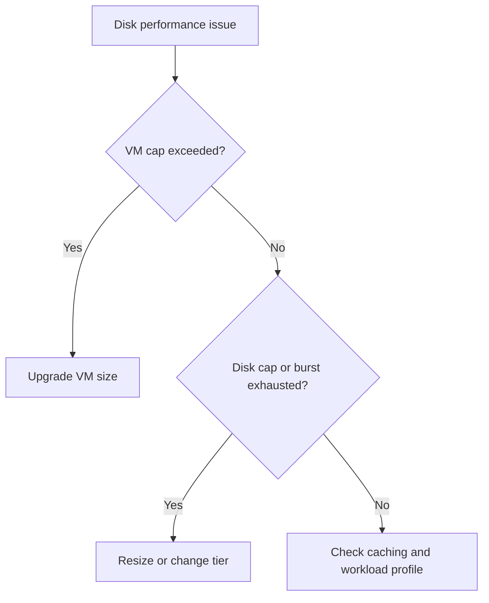

---
hide:
  - toc
---

# Disk Performance Issues

## 1. Summary

### Symptom
Disk latency rises, queue depth builds, or workloads hit IOPS and throughput limits even though the VM itself is otherwise reachable.

### Why this scenario is confusing
The limit may exist on the individual disk, the VM SKU aggregate cap, or the caching and workload pattern rather than the disk tier alone.

### Troubleshooting decision flow

## 2. Common Misreadings

- "Premium SSD always removes latency problems."
- "Only disk tier matters."
- "Caching should be enabled everywhere."

## 3. Competing Hypotheses

- **H1: VM-level aggregate IOPS or throughput cap reached**.
- **H2: Disk-level cap or burst exhausted**.
- **H3: Wrong host caching mode for workload**.
- **H4: Guest workload pattern is creating queue saturation**.

## 4. What to Check First

- Disk type, size, and expected performance ceiling.
- VM SKU storage limits.
- Read/write latency, IOPS, throughput, and queue depth.
- Host caching configuration and workload role.

## 5. Evidence to Collect

- Azure Monitor disk metrics and `iostat` or Perfmon output.
- Whether issue is read-heavy, write-heavy, or mixed.
- Current caching settings on OS and data disks.
- Whether Ultra Disk or Premium SSD v2 is involved.

## 6. Validation and Disproof by Hypothesis

### H1: VM-level cap reached
- **Supports**: sum of disk demand approaches VM limit.
- **Weakens**: plenty of VM headroom remains.

### H2: Disk-level cap reached
- **Supports**: one disk hits its known IOPS/throughput boundary.
- **Weakens**: the disk is below its service limit.

### H3: Wrong caching mode
- **Supports**: logs/data files use unsuitable cache mode and latency varies.
- **Weakens**: Ultra Disk or Premium SSD v2 where host caching does not apply.

### H4: Guest workload queue saturation
- **Supports**: guest queue grows before Azure-side limits are hit.
- **Weakens**: guest queue normal while Azure throttling is explicit.

## 7. Likely Root Cause Patterns

- Premium disk attached to an undersized VM.
- Standard SSD burst depleted during heavy activity.
- Database log disk left on cached mode.
- Too many hot workloads share the same VM storage budget.

## 8. Immediate Mitigations

- Move to a VM size with higher storage ceilings.
- Resize or retier the hot disk.
- Correct caching mode for data versus log paths.
- Spread heavy I/O across disks where appropriate.

## 9. Prevention

- Capacity-plan against both disk and VM limits.
- Review caching per workload role.
- Monitor queue depth and latency, not just throughput.

## See Also

- [Performance Checklist](../../first-10-minutes/performance.md)
- [High CPU / Memory / Disk](high-cpu-memory-disk.md)
- [Manage Disks](../../../operations/manage-disks.md)

## Sources

- [Azure Managed Disks performance](https://learn.microsoft.com/en-us/azure/virtual-machines/disks-performance)
- [Select the best disk tier for your workload](https://learn.microsoft.com/en-us/azure/virtual-machines/disks-types)
- [Troubleshoot performance bottlenecks on Azure VMs](https://learn.microsoft.com/en-us/troubleshoot/azure/virtual-machines/troubleshoot-performance-bottlenecks-linux)
