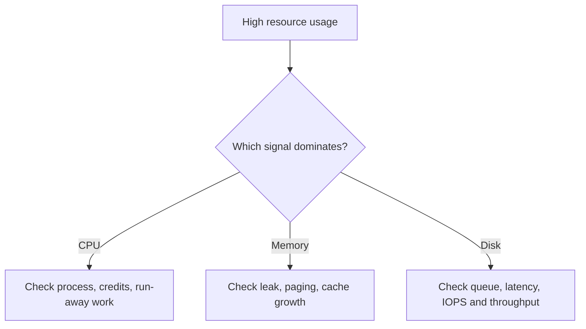

---
content_sources:
  diagrams:
  - id: troubleshooting-playbooks-performance-high-cpu-memory-disk-troubleshooting-decision-flow
    type: flowchart
    source: self-generated
    description: Troubleshooting decision flow
    based_on:
    - https://learn.microsoft.com/en-us/troubleshoot/azure/virtual-machines/windows/troubleshoot-high-cpu-issues-azure-windows-vm
    - https://learn.microsoft.com/en-us/troubleshoot/azure/virtual-machines/troubleshoot-performance-bottlenecks-linux
    - https://learn.microsoft.com/en-us/azure/virtual-machines/disks-performance-tiers
    justification: Synthesized for this guide from the referenced Microsoft Learn
      documentation.
---

# High CPU / Memory / Disk

## 1. Summary

### Symptom
One core resource is clearly exhausted: CPU pinned high, memory nearly depleted, or disk queue and latency are elevated.

### Why this scenario is confusing
The visible hot resource is not always the originating cause; for example, disk stalls can drive CPU wait time and memory pressure can trigger disk paging.

### Troubleshooting decision flow
<!-- diagram-id: troubleshooting-playbooks-performance-high-cpu-memory-disk-troubleshooting-decision-flow -->

## 2. Common Misreadings

- "High CPU means resize immediately."
- "Low free memory always means a leak."
- "Disk latency is only a storage-tier issue."

## 3. Competing Hypotheses

- **H1: Guest process saturation**.
- **H2: Burstable-credit depletion or undersized VM**.
- **H3: Memory pressure causing paging and secondary slowdown**.
- **H4: Disk throttling or queue buildup**.

## 4. What to Check First

- Dominant resource metric and incident duration.
- Process-level evidence from Task Manager, perfmon, `top`, `free -m`, `iostat`.
- VM SKU and burst-credit behavior if using B-series.
- Disk configuration and caching mode if storage is involved.

## 5. Evidence to Collect

- CPU percentage, credits, and top CPU process.
- Available memory, page faults, and reclaim pressure.
- Disk latency, queue depth, IOPS, throughput.
- Correlation with backup, extension, antivirus, or patch windows.

## 6. Validation and Disproof by Hypothesis

### H1: Guest process saturation
- **Supports**: one process consistently dominates CPU or memory.
- **Weakens**: no process-level outlier and platform cap is evident.

### H2: Undersized or burst-limited VM
- **Supports**: zero credits or chronic saturation at expected load.
- **Weakens**: larger peers show same issue from the same image/workload.

### H3: Memory pressure
- **Supports**: paging, very low available memory, degraded response before restart.
- **Weakens**: healthy memory and no paging.

### H4: Disk throttling
- **Supports**: high latency or queue despite modest CPU usage.
- **Weakens**: disk metrics stable while issue persists.

## 7. Likely Root Cause Patterns

- Run-away process after deployment.
- B-series workload outgrew credit model.
- Memory leak or large page cache growth.
- Data disk tier or VM throughput cap reached.

## 8. Immediate Mitigations

- Reduce the hot workload or stop the run-away process if safe.
- Resize or move off B-series when credits are exhausted.
- Add memory or remediate paging source.
- Shift to disk-specific analysis if storage metrics dominate.

## 9. Prevention

- Alert on CPU, guest memory, queue depth, and credits together.
- Capacity-plan by workload profile, not average utilization only.
- Review scheduled jobs that create periodic spikes.

## See Also

- [Performance Checklist](../../first-10-minutes/performance.md)
- [Slow Performance](slow-performance.md)
- [Managed Disk Types](../../../reference/managed-disk-types.md)

## Sources

- [Troubleshoot high CPU issues on Azure Windows VMs](https://learn.microsoft.com/en-us/troubleshoot/azure/virtual-machines/windows/troubleshoot-high-cpu-issues-azure-windows-vm)
- [Troubleshoot performance bottlenecks on Azure VMs](https://learn.microsoft.com/en-us/troubleshoot/azure/virtual-machines/troubleshoot-performance-bottlenecks-linux)
- [Understand VM disk throttling](https://learn.microsoft.com/en-us/azure/virtual-machines/disks-performance-tiers)
