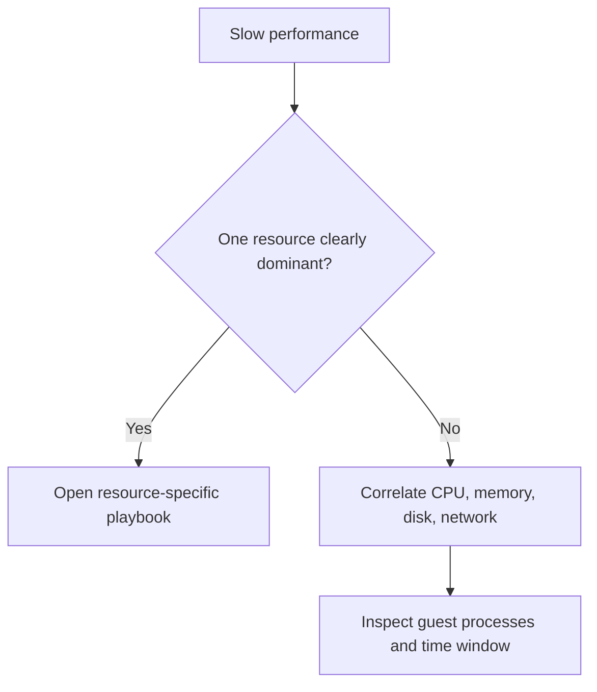

# Slow Performance

## 1. Summary

### Symptom
The VM feels slow, but the bottleneck is not immediately obvious from a single metric.

### Why this scenario is confusing
CPU, memory, disk, network, burst credits, and guest process behavior can all create the same user-visible slowdown.

### Troubleshooting decision flow

## 2. Common Misreadings

- "CPU is low, so the VM is healthy."
- "A larger VM is always the fastest fix."
- "Slow app means application issue only."

## 3. Competing Hypotheses

- **H1: CPU saturation or burst-credit depletion**.
- **H2: Memory pressure and paging**.
- **H3: Disk latency or queueing**.
- **H4: Network path or dependency slowness**.

## 4. What to Check First

- Same-window Azure Monitor metrics for CPU, disk, and network.
- Guest memory signal from VM Insights or OS tools.
- Recent changes: patching, deploy, backup, resize, extension run.
- Top processes and queue or latency evidence.

## 5. Evidence to Collect

- CPU trend, memory trend, disk latency/IOPS, network in/out.
- Guest process list and high wait-state observations.
- Whether issue is constant, bursty, or time-of-day dependent.
- Any dependence on B-series credit consumption.

## 6. Validation and Disproof by Hypothesis

### H1: CPU saturation or credit depletion
- **Supports**: sustained high CPU or zero B-series credits.
- **Weakens**: low CPU while memory/disk symptoms dominate.

### H2: Memory pressure
- **Supports**: low available memory, paging, reclaim pressure.
- **Weakens**: stable memory with no paging and fast recovery.

### H3: Disk latency
- **Supports**: queue depth, high read/write latency, storage throttling.
- **Weakens**: disk metrics normal during slowness.

### H4: Network or dependency slowness
- **Supports**: healthy local resources but slow remote calls or high RTT.
- **Weakens**: isolated local guest saturation explains the symptom fully.

## 7. Likely Root Cause Patterns

- Burstable VM credits exhausted.
- Guest memory leak or oversized working set.
- Standard disk or VM-size I/O limits reached.
- Dependency latency misread as local compute slowness.

## 8. Immediate Mitigations

- Reduce load or scale temporarily.
- Move to the resource-specific playbook for the dominant signal.
- Capture guest evidence before restarting.

## 9. Prevention

- Track guest memory and disk metrics, not just host CPU.
- Match VM family to workload profile.
- Review performance baselines after every major change.

## See Also

- [Performance Checklist](../../first-10-minutes/performance.md)
- [High CPU / Memory / Disk](high-cpu-memory-disk.md)
- [Disk Performance Issues](disk-performance-issues.md)

## Sources

- [Monitor Azure virtual machines](https://learn.microsoft.com/en-us/azure/azure-monitor/vm/monitor-virtual-machine)
- [Troubleshoot performance bottlenecks on Azure VMs](https://learn.microsoft.com/en-us/troubleshoot/azure/virtual-machines/troubleshoot-performance-bottlenecks-linux)
