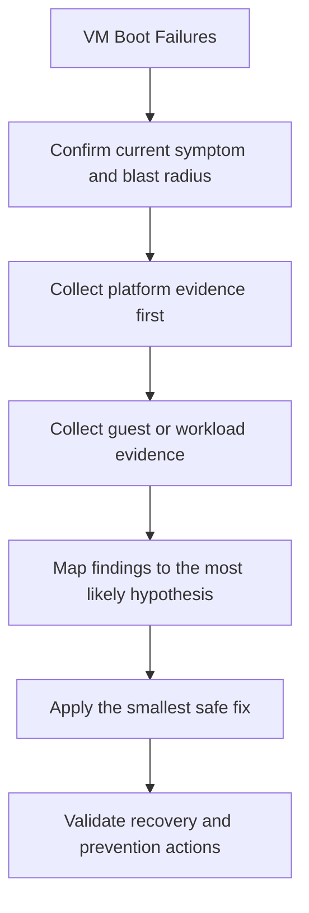

---
content_sources:
  diagrams:
  - id: troubleshooting-playbooks-vm-boot-failures-symptoms
    type: flowchart
    source: self-generated
    description: Symptoms
    based_on:
    - https://learn.microsoft.com/en-us/troubleshoot/azure/virtual-machines/welcome-virtual-machines
    - https://learn.microsoft.com/en-us/azure/virtual-machines/boot-diagnostics
    - https://learn.microsoft.com/en-us/azure/bastion/bastion-connect-vm-rdp-windows
    - https://learn.microsoft.com/en-us/azure/virtual-machines/disks-performance
    - https://learn.microsoft.com/en-us/azure/virtual-network/accelerated-networking-overview
    justification: Synthesized for this guide from the referenced Microsoft Learn
      documentation.
---

# VM Boot Failures

## Symptoms

- Administrative or workload impact is visible to users or operators.
- The VM is deployed, but one part of the expected control plane or data path is failing.
- You need a fast way to narrow the problem before making a risky change.

<!-- diagram-id: troubleshooting-playbooks-vm-boot-failures-symptoms -->


## 1. Summary

Use this playbook when a VM never reaches a usable OS state, cycles through boot diagnostics errors, or shows a black screen, GRUB issue, BitLocker prompt, or kernel panic in serial console output.

Boot diagnostics, serial console, extension state, OS disk health, and recovery actions.

## 2. Common Misreadings

| Observation | Often misread as | Actually means |
|---|---|---|
| One failed probe or one stale metric | Total VM outage | The issue may be scoped to one path or one recovery dependency. |
| A successful extension deployment | Guest health is good | Extensions can succeed while the underlying guest service still fails. |
| A recent change record | Guaranteed root cause | Recent changes are strong leads, but they still need proof from evidence. |
| A restart fixes the issue | Permanent resolution | Recovery after restart may only hide the real structural cause. |

## 3. Competing Hypotheses

| Hypothesis | Likelihood | Key discriminator |
|---|---|---|
| Control-plane or configuration drift | High | Azure resource state no longer matches the intended pattern. |
| Guest OS or agent issue | High | Guest or serial evidence shows service, boot, or firewall failure. |
| Capacity or platform dependency bottleneck | Medium | Metrics or SKU limits explain the symptom better than configuration drift. |
| Security control blocked expected behavior | Medium | NSG, ASG, JIT, or policy state changed before the incident. |
| External dependency issue | Low | VM appears healthy, but a downstream service path is broken. |

## 4. What to Check First

1. **Review VM instance view**

    ```bash
    az vm get-instance-view             --resource-group $RG             --name $VM_NAME             --output json
    ```

2. **Review boot diagnostics settings**

    ```bash
    az vm boot-diagnostics get-boot-log             --resource-group $RG             --name $VM_NAME
    ```

3. **Review NIC effective security rules**

    ```bash
    az network nic list-effective-nsg             --resource-group $RG             --name $NIC_NAME             --output json
    ```

4. **Review recent platform changes**

    ```bash
    az monitor activity-log list             --resource-group $RG             --offset 24h             --output table
    ```

## 5. Evidence to Collect

### 5.1 KQL Queries

```kusto
// Activity and maintenance events
AzureActivity
| where TimeGenerated > ago(24h)
| where ResourceProviderValue =~ "MICROSOFT.COMPUTE"
| where ResourceId has "/virtualMachines/"
| project TimeGenerated, OperationNameValue, ActivityStatusValue, Caller, ResourceId
| order by TimeGenerated desc
```

| Field | Interpretation |
|---|---|
| `TimeGenerated` | Incident sequence and correlation window. |
| Resource identifier | Confirms the signal belongs to the affected VM. |
| Operation or metric value | Explains whether the failure is change-driven, capacity-driven, or guest-driven. |

!!! tip "How to read this"
    Compare these results with the last known healthy window. A change in shape matters more than a single absolute value.

```kusto
// Heartbeat and guest gap
Heartbeat
| where TimeGenerated > ago(24h)
| summarize LastHeartbeat=max(TimeGenerated) by Computer, _ResourceId
| order by LastHeartbeat asc
```

| Field | Interpretation |
|---|---|
| `TimeGenerated` | Incident sequence and correlation window. |
| Resource identifier | Confirms the signal belongs to the affected VM. |
| Operation or metric value | Explains whether the failure is change-driven, capacity-driven, or guest-driven. |

!!! tip "How to read this"
    Compare these results with the last known healthy window. A change in shape matters more than a single absolute value.

### 5.2 CLI Investigation

```bash
az vm show     --resource-group $RG     --name $VM_NAME     --query "{powerState:powerState,vmSize:hardwareProfile.vmSize,priority:priority,provisioningState:provisioningState}"     --output json

az network nic show     --resource-group $RG     --name $NIC_NAME     --query "{ipConfigs:ipConfigurations[].privateIPAddress,acceleratedNetworking:enableAcceleratedNetworking,networkSecurityGroup:networkSecurityGroup.id}"     --output json
```

Interpretation:

- If the VM is not in a usable power state, fix power and boot issues before guest remediation.
- If the NIC or NSG binding is wrong, repair the control plane before changing guest settings.
- If accelerated networking or disk attachment changed after a resize, validate that the new size still supports the intended feature set.

## 6. Validation and Disproof by Hypothesis

### Hypothesis 1: Configuration drift or recent change

**Proves if**: Evidence clearly shows the current state changed from the last healthy pattern in a way that explains the symptom.

**Disproves if**: Control-plane, guest, and capacity evidence all remain healthy and consistent with baseline.

Recommended validation steps:

1. Compare Azure Activity Log against the incident start time.
2. Compare current configuration with the approved landing zone pattern.
3. Review the most recent guest evidence or boot or connection output.
4. Re-test the original symptom after the smallest safe correction.

### Hypothesis 2: Guest OS or service failure

**Proves if**: Evidence clearly shows the current state changed from the last healthy pattern in a way that explains the symptom.

**Disproves if**: Control-plane, guest, and capacity evidence all remain healthy and consistent with baseline.

Recommended validation steps:

1. Compare Azure Activity Log against the incident start time.
2. Compare current configuration with the approved landing zone pattern.
3. Review the most recent guest evidence or boot or connection output.
4. Re-test the original symptom after the smallest safe correction.

### Hypothesis 3: Capacity limit or SKU mismatch

**Proves if**: Evidence clearly shows the current state changed from the last healthy pattern in a way that explains the symptom.

**Disproves if**: Control-plane, guest, and capacity evidence all remain healthy and consistent with baseline.

Recommended validation steps:

1. Compare Azure Activity Log against the incident start time.
2. Compare current configuration with the approved landing zone pattern.
3. Review the most recent guest evidence or boot or connection output.
4. Re-test the original symptom after the smallest safe correction.

### Hypothesis 4: Security control blocking the expected path

**Proves if**: Evidence clearly shows the current state changed from the last healthy pattern in a way that explains the symptom.

**Disproves if**: Control-plane, guest, and capacity evidence all remain healthy and consistent with baseline.

Recommended validation steps:

1. Compare Azure Activity Log against the incident start time.
2. Compare current configuration with the approved landing zone pattern.
3. Review the most recent guest evidence or boot or connection output.
4. Re-test the original symptom after the smallest safe correction.

## 7. Likely Root Cause Patterns

| Pattern | Evidence | Resolution |
|---|---|---|
| Unsupported feature after resize or redeploy | Settings drift, feature not enabled, or SKU capability mismatch | Move back to a supported size or re-enable the feature with validation. |
| NSG or route or JIT drift | Effective rules do not match the intended admin or workload path | Repair the policy and document the expected flow. |
| Guest service stopped or corrupted | Serial, extension, or guest evidence points to OS-level failure | Repair the guest service, driver, boot loader, or firewall configuration. |
| Performance bottleneck blamed as an outage | CPU, memory, or disk metrics saturate before the user-visible failure | Resize, retier, or redistribute workload pressure. |

## 8. Immediate Mitigations

1. Capture a fresh screenshot and serial log before restarting so you do not lose the failure signature.
2. Validate whether the issue started after patching, kernel update, disk encryption change, or availability host maintenance.
3. Repair boot loader, filesystem, or driver issues using the Azure serial console or VM repair workflow.

Step-by-step resolution:

1. Stabilize the VM or admin path without erasing forensic evidence.
2. Correct the control-plane configuration first when Azure intent is clearly wrong.
3. Apply guest-side repair only after confirming the platform path is healthy.
4. Re-run the original command, probe, or sign-in flow to verify recovery.
5. Record the exact evidence that proved the fix, not just that the symptom disappeared.

CLI commands commonly used during fixes:

```bash
az vm run-command invoke     --resource-group $RG     --name $VM_NAME     --command-id RunShellScript     --scripts "sudo systemctl status walinuxagent"

az vm restart     --resource-group $RG     --name $VM_NAME
```

## 9. Prevention

### Prevention checklist

- [ ] Keep a documented healthy baseline for VM size, NIC, disk, and admin-path settings
- [ ] Alert on drift in critical VM security and connectivity controls
- [ ] Test boot diagnostics, Bastion, serial console, and backup restore before production go-live
- [ ] Review SKU feature compatibility before resize operations
- [ ] Capture post-incident evidence and turn it into a reusable guardrail

## See Also

- [Troubleshooting Index](index.md)
- [First 10 Minutes](../first-10-minutes/index.md)
- [Decision Tree](../decision-tree.md)

## Sources

- [Troubleshoot Azure virtual machines](https://learn.microsoft.com/en-us/troubleshoot/azure/virtual-machines/welcome-virtual-machines)
- [Boot diagnostics for Azure virtual machines](https://learn.microsoft.com/en-us/azure/virtual-machines/boot-diagnostics)
- [Connect to a VM with Azure Bastion](https://learn.microsoft.com/en-us/azure/bastion/bastion-connect-vm-rdp-windows)
- [Azure Managed Disks performance](https://learn.microsoft.com/en-us/azure/virtual-machines/disks-performance)
- [Accelerated networking overview](https://learn.microsoft.com/en-us/azure/virtual-network/accelerated-networking-overview)
