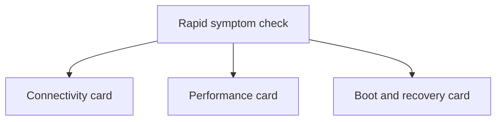
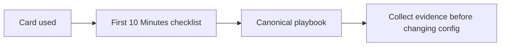

---
hide:
  - toc
---

# Quick Diagnosis Cards

Use these cards when you need to route a VM incident quickly without reading the full playbooks first.

## Rapid triage map

## Card 1: Connectivity

| If you see | Check first | Then open |
|---|---|---|
| RDP or SSH timeout | NSG, effective routes, VM power state | [Cannot RDP or SSH](playbooks/connectivity/cannot-rdp-or-ssh.md) |
| DNS lookup fails | VNet DNS settings, `168.63.129.16`, peering | [DNS and Connectivity Issues](playbooks/connectivity/dns-and-connectivity-issues.md) |
| extension install/provisioning failed | VM agent status, extension logs, outbound access | [Extension Failures](playbooks/connectivity/extension-failures.md) |

## Card 2: Performance

| If you see | Check first | Then open |
|---|---|---|
| general slowness | CPU, memory, disk, network trend | [Slow Performance](playbooks/performance/slow-performance.md) |
| one metric pinned high | top process, paging, queue depth, credits | [High CPU / Memory / Disk](playbooks/performance/high-cpu-memory-disk.md) |
| storage latency or throttling | disk tier, caching, VM cap, `iostat` | [Disk Performance Issues](playbooks/performance/disk-performance-issues.md) |

## Card 3: Boot and recovery

| If you see | Check first | Then open |
|---|---|---|
| VM won't enter running state | Activity Log, boot screenshot, recent size/host events | [VM Won't Start](playbooks/boot-disk/vm-wont-start.md) |
| no network access during startup issue | Boot Diagnostics and Serial Console | [Boot Diagnostics and Serial Console](playbooks/boot-disk/boot-diagnostics-and-serial-console.md) |
| backup or snapshot failure | backup error code, VM agent, disk lock | [Backup Failures](playbooks/boot-disk/backup-failures.md) |

## Escalation rule

## See Also

- [Decision Tree](decision-tree.md)
- [First 10 Minutes](first-10-minutes/index.md)
- [Playbooks](playbooks/index.md)

## Sources

- [Azure Virtual Machines documentation](https://learn.microsoft.com/en-us/azure/virtual-machines/)
- [Troubleshoot Azure virtual machines](https://learn.microsoft.com/en-us/troubleshoot/azure/virtual-machines/welcome-virtual-machines)
