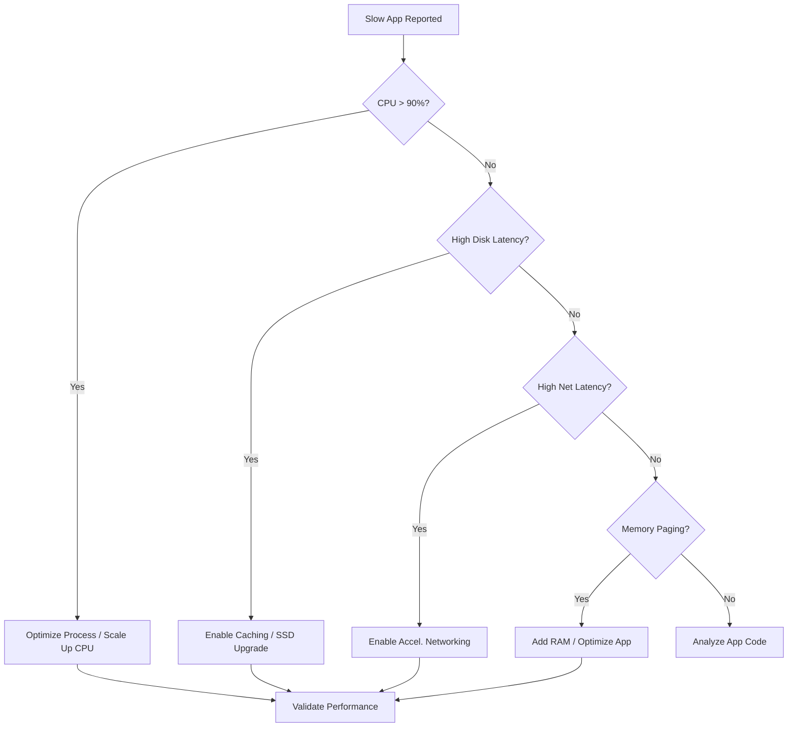

# Slow Performance

Diagnosing slow performance requires distinguishing between platform-level throttling and guest-level resource exhaustion. Correlate Azure Monitor metrics with internal operating system tools to identify the bottleneck.

## Bottleneck Diagnostics Matrix

| Bottleneck Type | Azure Metric | Guest OS Tool | Resolution |
| :--- | :--- | :--- | :--- |
| CPU | Percentage CPU | Task Manager / top | Upgrade VM size; check for run-away processes. |
| Memory | Available Memory | Perfmon / free -m | Scale up VM RAM; check for memory leaks. |
| Disk | OS/Data Disk IOPS | iostat / Disk Management | Change disk tier; adjust caching. |
| Network | Network In/Out | Netstat / Resource Monitor | Use Accelerated Networking; upgrade VM series. |

!!! note
    Memory consumption is not automatically tracked by Azure host metrics. Enable the Log Analytics agent or Azure Monitor agent to collect guest-level memory statistics.

## Performance Optimization Flow

!!! tip
    Standardize on the "D-Series" or "E-Series" for most production workloads to avoid the performance variance inherent in "B-Series" burstable VMs.

## Sources
- [Troubleshoot slow performance on Windows VM](https://learn.microsoft.com/en-us/troubleshoot/azure/virtual-machines/linux/troubleshoot-performance-virtual-machine-linux-windows)
- [Monitor Azure Virtual Machine performance](https://learn.microsoft.com/en-us/azure/virtual-machines/monitor-vm)
- [How to use Azure Monitor to troubleshoot performance](https://learn.microsoft.com/en-us/azure/azure-monitor/essentials/monitor-azure-resource)
