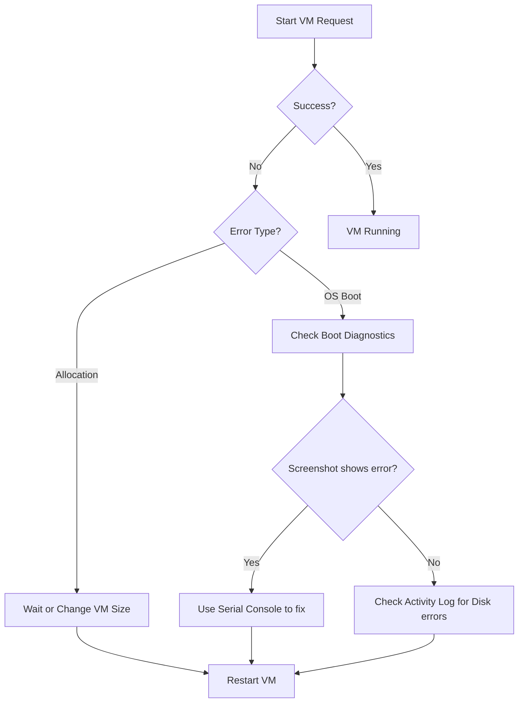

---
hide:
  - toc
---

# VM Won't Start

Azure Virtual Machines may fail to start due to host-level constraints, operating system boot errors, or configuration issues. Use the following diagnostic tools and resolution paths to restore service.

## Resolution Matrix

| Symptom | Likely Cause | Diagnostic Tool | Resolution |
| :--- | :--- | :--- | :--- |
| Allocation failure | No capacity in cluster | Activity Log | Stop/Deallocate, wait, and restart. |
| OS boot loop | Corrupt boot files | Boot Diagnostics | Use Serial Console to repair BCD or GRUB. |
| Stuck at "Starting" | Disk attachment failure | Activity Log | Detach/reattach data disks; check OS disk health. |
| Blue/Black screen | Driver or OS update failure | Boot Diagnostics | Roll back updates via Serial Console or Backup. |

!!! note
    Allocation failures often occur when resizing a VM to a series not available in the current cluster. Try starting the VM again after a few minutes or choose a different size.

## Troubleshooting Flow

!!! tip
    Enable Boot Diagnostics on all VMs to get real-time screenshots of the boot process without needing an RDP or SSH connection. Boot Diagnostics uses managed storage by default.

## See Also

- [Boot Diagnostics and Serial Console](../troubleshooting/boot-diagnostics-and-serial-console.md)

## Sources
- [Troubleshoot Azure VM starting issues](https://learn.microsoft.com/en-us/troubleshoot/azure/virtual-machines/troubleshoot-vm-boot-error)
- [Allocation failures when you create or resize VMs](https://learn.microsoft.com/en-us/troubleshoot/azure/virtual-machines/allocation-failure)
- [Understand boot diagnostics](https://learn.microsoft.com/en-us/azure/virtual-machines/boot-diagnostics)
