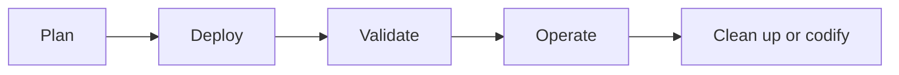

---
hide:
- toc
content_sources:
  diagrams:
  - id: tutorials-index-what-you-will-find-here
    type: flowchart
    source: self-generated
    description: What you will find here
    based_on:
    - https://learn.microsoft.com/en-us/azure/virtual-machines/
    justification: Synthesized for this guide from the referenced Microsoft Learn
      documentation.
---

# Tutorials

Hands-on tutorials show how to apply Azure VM design and operational guidance in a controlled environment before you rely on the pattern in production.

## What you will find here

- Guided labs for availability, storage protection, administration, automation, and disaster recovery
- Copy-paste-ready Azure CLI commands with long flags only
- Validation and cleanup steps so each exercise can be repeated safely

<!-- diagram-id: tutorials-index-what-you-will-find-here -->

## See Also

- [Best Practices](../best-practices/index.md)
- [Operations](../operations/index.md)
- [Troubleshooting](../troubleshooting/index.md)

## Sources

- [Azure virtual machines documentation](https://learn.microsoft.com/en-us/azure/virtual-machines/)
