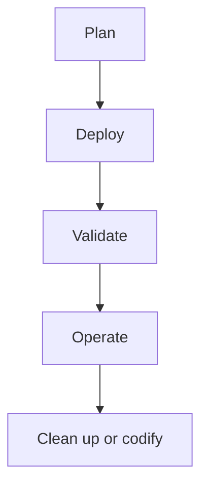

---
content_sources:
  diagrams:
  - id: tutorials-index-what-you-will-find-here
    type: flowchart
    source: self-generated
    description: What you will find here
    based_on:
    - https://learn.microsoft.com/en-us/azure/virtual-machines/
    justification: Synthesized for this guide from the referenced Microsoft Learn
      documentation.
content_validation:
  status: verified
  last_reviewed: '2026-05-23'
  reviewer: agent
  core_claims:
  - claim: This page uses Microsoft Learn as the primary source basis for its Azure-specific
      guidance.
    source: https://learn.microsoft.com/en-us/azure/virtual-machines/
    verified: true
---
# Tutorials

Hands-on tutorials show how to apply Azure VM design and operational guidance in a controlled environment before you rely on the pattern in production.

## What you will find here

- Guided labs for availability, storage protection, administration, automation, and disaster recovery
- Copy-paste-ready Azure CLI commands with long flags only
- Validation and cleanup steps so each exercise can be repeated safely

<!-- diagram-id: tutorials-index-what-you-will-find-here -->

```mermaid
flowchart TD
    A[Plan] --> B[Deploy]
    B --> C[Validate]
    C --> D[Operate]
    D --> E[Clean up or codify]
```

## Review Matrix

| Review area | Page-specific check |
|---|---|
| Scope | Confirm the guidance applies to Tutorials. |
| Source basis | Validate the recommendation against the Microsoft Learn sources in this page. |
| Evidence | Capture command output, portal state, metrics, logs, or screenshots before treating the result as proven. |

## See Also

- [Best Practices](../best-practices/index.md)
- [Operations](../operations/index.md)
- [Troubleshooting](../troubleshooting/index.md)

## Sources

- [Azure virtual machines documentation](https://learn.microsoft.com/en-us/azure/virtual-machines/)
