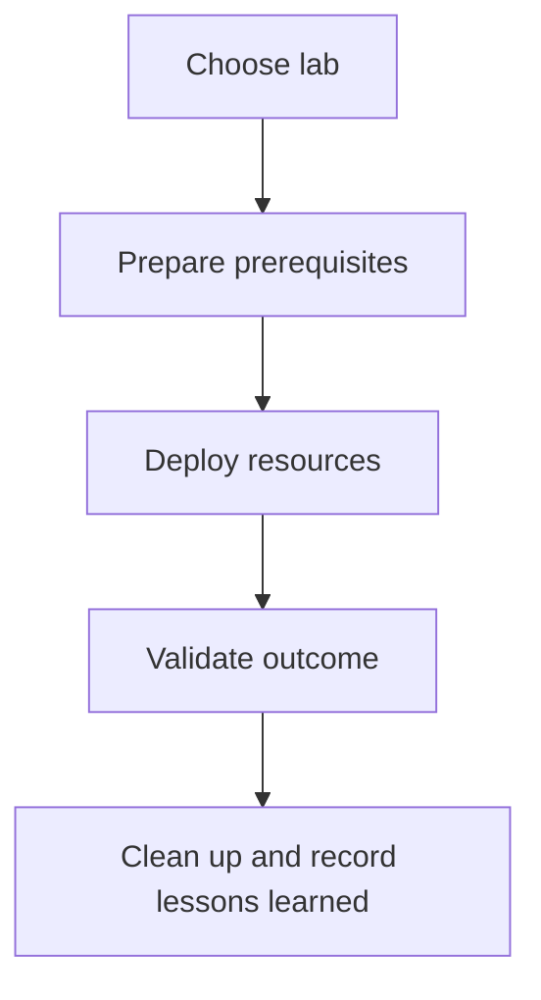

---
hide:
- toc
content_sources:
  diagrams:
  - id: tutorials-lab-guides-index-lab-guides
    type: flowchart
    source: self-generated
    description: Lab Guides
    based_on:
    - https://learn.microsoft.com/en-us/azure/virtual-machines/
    justification: Synthesized for this guide from the referenced Microsoft Learn
      documentation.
---

# Lab Guides

These labs convert Azure VM guidance into repeatable exercises. Use them to validate architecture decisions, train operators, and capture evidence you can compare against future incidents.

<!-- diagram-id: tutorials-lab-guides-index-lab-guides -->

## Lab Catalog

| Lab | Focus |
|---|---|
| [Lab 01: Highly Available VM Deployment](lab-01-highly-available-vm-deployment.md) | Availability Zones, Load Balancer, VMSS baseline |
| [Lab 02: Disk Encryption and Backup](lab-02-disk-encryption-and-backup.md) | Encryption controls and backup readiness |
| [Lab 03: Custom Script Extensions](lab-03-custom-script-extensions.md) | Guest bootstrap automation and extension troubleshooting |
| [Lab 04: Azure Bastion and JIT Access](lab-04-azure-bastion-jit-access.md) | Private administration path and privileged access hardening |
| [Lab 05: VM Disaster Recovery with Azure Site Recovery](lab-05-vm-disaster-recovery-asr.md) | Replication, failover, and DR validation |

## See Also

- [Tutorials](../index.md)
- [Best Practices](../../best-practices/index.md)
- [Troubleshooting Playbooks](../../troubleshooting/playbooks/index.md)

## Sources

- [Azure virtual machines documentation](https://learn.microsoft.com/en-us/azure/virtual-machines/)
