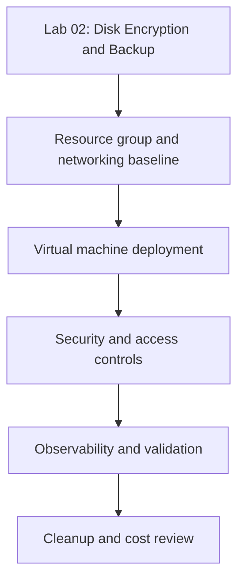

---
hide:
  - toc
---

# Lab 02: Disk Encryption and Backup

Apply disk encryption controls, enable backup protection, and validate restore-readiness for a protected VM.

## Prerequisites

- Azure subscription with contributor-level access to compute, network, backup, and monitoring resources
- Azure CLI installed and signed in
- Variables set for the lab:
    - `RG`
    - `VM_NAME`
    - `LOCATION`
    - `VNET_NAME`
    - `SUBNET_NAME`
- A Log Analytics workspace or backup vault where the lab requires it

## Architecture Diagram



## Lab Metadata

| Field | Value |
|---|---|
| Lab file | `lab-02-disk-encryption-and-backup.md` |
| Estimated duration | 45-75 minutes |
| Difficulty | Intermediate |
| Focus technologies | Encryption at host, ADE migration context, Azure Backup |
| Cost profile | Moderate; deallocate or clean up immediately after validation |

## Step-by-step Instructions

### Step 1: Create the resource group and network baseline

```bash
az group create     --name $RG     --location $LOCATION     --output json

az network vnet create     --resource-group $RG     --name $VNET_NAME     --address-prefixes 10.40.0.0/16     --subnet-name $SUBNET_NAME     --subnet-prefixes 10.40.1.0/24     --output json
```

Expected outcome:

- The resource group exists in the intended region.
- The virtual network and subnet are available for VM deployment.

### Step 2: Deploy the base VM

```bash
az vm create     --resource-group $RG     --name $VM_NAME     --image Ubuntu2204     --size Standard_D4s_v5     --admin-username azureuser     --generate-ssh-keys     --vnet-name $VNET_NAME     --subnet $SUBNET_NAME     --public-ip-sku Standard     --storage-sku Premium_LRS     --output json
```

Expected outcome:

- The VM deploys with Premium SSD-backed storage and a predictable network baseline.
- You have enough CPU, memory, and NIC capability to test the scenario without using a tiny burstable SKU.

### Step 3: Apply the lab-specific configuration

Use this step to apply the feature under test and document why it matters for production.

```bash
az vm show     --resource-group $RG     --name $VM_NAME     --query "{name:name,vmSize:hardwareProfile.vmSize,zone:zones,storageProfile:storageProfile.osDisk.managedDisk.storageAccountType}"     --output json
```

Recommended operator notes:

- Capture the command output in your lab log.
- Record any prerequisites unique to your region, vault, or security policy.
- If the feature depends on another Azure service, confirm that dependency before continuing.

### Step 4: Validate the scenario end to end

Run both control-plane and workload validation so the result is useful during a real incident or audit.

```bash
az vm get-instance-view     --resource-group $RG     --name $VM_NAME     --output json

az monitor activity-log list     --resource-group $RG     --offset 2h     --output table
```

### Step 5: Optional operational hardening

- Review whether the lab design should also use accelerated networking or proximity placement groups.
- Review whether JIT access, ASGs, and backup retention should be part of the same deployment workflow.
- Review whether Reserved Instances, Spot, or auto-shutdown affect the scenario economics.

## Validation Steps

Use the following validation checklist before marking the lab complete:

- [ ] The VM is in the expected power and provisioning state
- [ ] The intended feature change is visible in Azure resource properties
- [ ] At least one CLI verification command was captured after the change
- [ ] You can explain how the lab outcome would change production design or troubleshooting

## Cleanup Instructions

```bash
az vm delete     --resource-group $RG     --name $VM_NAME     --yes

az network nic delete     --resource-group $RG     --name "${VM_NAME}VMNic"

az group delete     --name $RG     --yes     --no-wait
```

Cleanup notes:

- Delete associated disks, public IPs, Bastion hosts, vault items, or replication resources if the lab created them.
- Review whether backup vaults or recovery services still hold retained items that continue billing after VM deletion.

## See Also

- [Best Practices](../../best-practices/index.md)
- [Operations](../../operations/index.md)
- [Troubleshooting Playbooks](../../troubleshooting/playbooks/index.md)

## Sources

- [Azure virtual machines documentation](https://learn.microsoft.com/en-us/azure/virtual-machines/)
- [Azure CLI for virtual machines](https://learn.microsoft.com/en-us/cli/azure/vm)
- [Azure Backup for virtual machines](https://learn.microsoft.com/en-us/azure/backup/backup-azure-vms-introduction)
- [Azure Site Recovery for Azure VMs](https://learn.microsoft.com/en-us/azure/site-recovery/azure-to-azure-tutorial-enable-replication)
