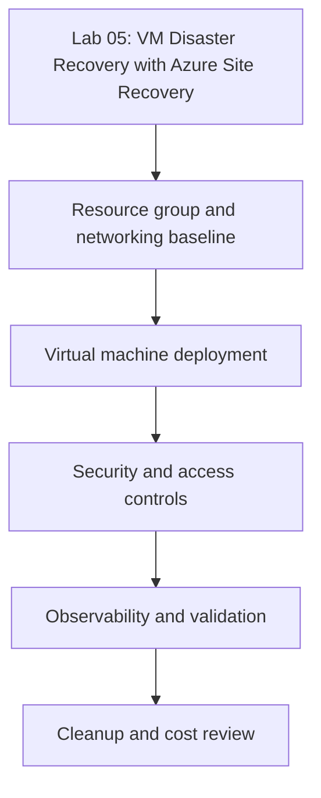

---
content_sources:
  diagrams:
    - id: tutorials-lab-guides-lab-05-vm-disaster-recovery-asr-architecture-diagram
      type: flowchart
      source: mslearn-adapted
      description: Architecture Diagram
      based_on:
        - https://learn.microsoft.com/en-us/azure/virtual-machines/
        - https://learn.microsoft.com/en-us/cli/azure/vm
        - https://learn.microsoft.com/en-us/azure/backup/backup-azure-vms-introduction
        - https://learn.microsoft.com/en-us/azure/site-recovery/azure-to-azure-tutorial-enable-replication
validation:
  az_cli:
    last_tested:
    result: not_tested
  bicep:
    last_tested:
    result: not_tested
---
# Lab 05: VM Disaster Recovery with Azure Site Recovery

Configure Azure Site Recovery for a critical VM, run a test failover, and document the validation artifacts needed for a real DR event.

## Prerequisites

- Azure subscription with contributor-level access to compute, network, backup, and monitoring resources
- Azure CLI installed and signed in
- Variables set for the lab:
    - `RG`
    - `VM_NAME`
    - `LOCATION`
    - `VNET_NAME`
    - `SUBNET_NAME`
- A Log Analytics workspace or backup vault where the lab requires it

## Architecture Diagram

<!-- diagram-id: tutorials-lab-guides-lab-05-vm-disaster-recovery-asr-architecture-diagram -->


## Lab Metadata

| Field | Value |
|---|---|
| Lab file | `lab-05-vm-disaster-recovery-asr.md` |
| Estimated duration | 45-75 minutes |
| Difficulty | Intermediate |
| Focus technologies | Azure Site Recovery, replication, failover drills |
| Cost profile | Moderate; deallocate or clean up immediately after validation |

## Step-by-step Instructions

### Step 1: Create the resource group and network baseline

```bash
az group create \
    --name $RG \
    --location $LOCATION \
    --output json

az network vnet create \
    --resource-group $RG \
    --name $VNET_NAME \
    --address-prefixes 10.40.0.0/16 \
    --subnet-name $SUBNET_NAME \
    --subnet-prefixes 10.40.1.0/24 \
    --output json
```

| Command | Purpose |
| --- | --- |
| `az group create` | Create the resource group for the lab. |
| `--name` | Name of the resource group to create. |
| `--location` | Azure region for the resource group. |
| `--output` | Output format for the response (JSON here). |
| `az network vnet create` | Create the virtual network and its initial subnet. |
| `--resource-group` | Resource group that will contain the virtual network. |
| `--name` | Name of the virtual network to create. |
| `--address-prefixes` | Address space (CIDR) for the virtual network. |
| `--subnet-name` | Name of the initial subnet to create. |
| `--subnet-prefixes` | CIDR range assigned to the subnet. |
| `--output` | Output format for the response (JSON here). |

Expected outcome:

- The resource group exists in the intended region.
- The virtual network and subnet are available for VM deployment.

### Step 2: Deploy the base VM

```bash
az vm create \
    --resource-group $RG \
    --name $VM_NAME \
    --image Ubuntu2204 \
    --size Standard_D4s_v5 \
    --admin-username azureuser \
    --generate-ssh-keys \
    --vnet-name $VNET_NAME \
    --subnet $SUBNET_NAME \
    --public-ip-sku Standard \
    --storage-sku Premium_LRS \
    --output json
```

| Command | Purpose |
| --- | --- |
| `az vm create` | Create a virtual machine in the lab virtual network. |
| `--resource-group` | Resource group that will contain the virtual machine. |
| `--name` | Name of the virtual machine to create. |
| `--image` | Marketplace image or alias for the OS (Ubuntu2204). |
| `--size` | VM size (SKU) to provision. |
| `--admin-username` | Administrator user name for the guest OS. |
| `--generate-ssh-keys` | Generate an SSH key pair if one does not already exist. |
| `--vnet-name` | Existing virtual network to attach the VM to. |
| `--subnet` | Subnet within the virtual network for the VM NIC. |
| `--public-ip-sku` | SKU for the public IP address (Standard). |
| `--storage-sku` | Managed-disk storage SKU for the OS disk (Premium_LRS). |
| `--output` | Output format for the response (JSON here). |

Expected outcome:

- The VM deploys with Premium SSD-backed storage and a predictable network baseline.
- You have enough CPU, memory, and NIC capability to test the scenario without using a tiny burstable SKU.

### Step 3: Capture the source workload state for replication

Before you enable Azure Site Recovery, record the VM characteristics that the target region must reproduce so your failover test validates the right source configuration.

```bash
az vm show \
    --resource-group $RG \
    --name $VM_NAME \
    --query "{name:name,location:location,vmSize:hardwareProfile.vmSize,zone:zones,storageProfile:storageProfile.osDisk.managedDisk.storageAccountType}" \
    --output json
```

| Command | Purpose |
| --- | --- |
| `az vm show` | Retrieve the current configuration of the virtual machine. |
| `--resource-group` | Resource group that contains the virtual machine. |
| `--name` | Name of the virtual machine to inspect. |
| `--query` | JMESPath expression selecting location, size, zone, and OS-disk storage type. |
| `--output` | Output format for the response (JSON here). |

Recommended operator notes:

- Record the source region and zone placement so you can verify the target-region replication design is intentional.
- Note the target virtual network, DNS, and identity dependencies that must exist before test failover.
- Record the recovery point objective and the validation evidence you expect from the failover drill.

### Step 4: Validate the scenario end to end

Run both control-plane and workload validation so you have a clean baseline before replication and failover testing begin.

```bash
az vm get-instance-view \
    --resource-group $RG \
    --name $VM_NAME \
    --output json

az monitor activity-log list \
    --resource-group $RG \
    --offset 2h \
    --output table
```

| Command | Purpose |
| --- | --- |
| `az vm get-instance-view` | Retrieve the runtime instance view (power and provisioning state) of the VM. |
| `--resource-group` | Resource group that contains the virtual machine. |
| `--name` | Name of the virtual machine to inspect. |
| `--output` | Output format for the response (JSON here). |
| `az monitor activity-log list` | List recent control-plane activity-log events. |
| `--resource-group` | Resource group to scope activity-log events to. |
| `--offset` | Look-back window for events (2h here). |
| `--output` | Output format for the response (table here). |

### Step 5: Optional operational hardening

- Review whether replication alone is enough or whether the service also needs a documented application cutover sequence.
- Review whether failover networking, name resolution, and security controls exist in the target region.
- Review whether the workload still needs Azure Backup after ASR is enabled, because replication is not the same as backup retention.

## Validation Steps

Use the following validation checklist before marking the lab complete:

- [ ] The VM is in the expected power and provisioning state
- [ ] The intended feature change is visible in Azure resource properties
- [ ] At least one CLI verification command was captured after the change
- [ ] You can explain how the lab outcome would change production design or troubleshooting

## Cleanup Instructions

```bash
az vm delete \
    --resource-group $RG \
    --name $VM_NAME \
    --yes

az network nic delete \
    --resource-group $RG \
    --name "${VM_NAME}VMNic"

az group delete \
    --name $RG \
    --yes \
    --no-wait
```

| Command | Purpose |
| --- | --- |
| `az vm delete` | Delete the virtual machine. |
| `--resource-group` | Resource group that contains the virtual machine. |
| `--name` | Name of the virtual machine to delete. |
| `--yes` | Skip the confirmation prompt. |
| `az network nic delete` | Delete the network interface left behind by the VM. |
| `--resource-group` | Resource group that contains the network interface. |
| `--name` | Name of the network interface to delete. |
| `az group delete` | Delete the resource group and all remaining lab resources. |
| `--name` | Name of the resource group to delete. |
| `--yes` | Skip the confirmation prompt. |
| `--no-wait` | Return immediately without waiting for deletion to finish. |

Cleanup notes:

- Delete associated disks, public IPs, Bastion hosts, vault items, or replication resources if the lab created them.
- Review whether backup vaults or recovery services still hold retained items that continue billing after VM deletion.

## See Also

- [Best Practices](../../best-practices/index.md)
- [Operations](../../operations/index.md)
- [Troubleshooting Playbooks](../../troubleshooting/playbooks/index.md)

## Sources

- [Azure virtual machines documentation](https://learn.microsoft.com/en-us/azure/virtual-machines/)
- [Azure CLI for virtual machines](https://learn.microsoft.com/en-us/cli/azure/vm)
- [Azure Backup for virtual machines](https://learn.microsoft.com/en-us/azure/backup/backup-azure-vms-introduction)
- [Azure Site Recovery for Azure VMs](https://learn.microsoft.com/en-us/azure/site-recovery/azure-to-azure-tutorial-enable-replication)
