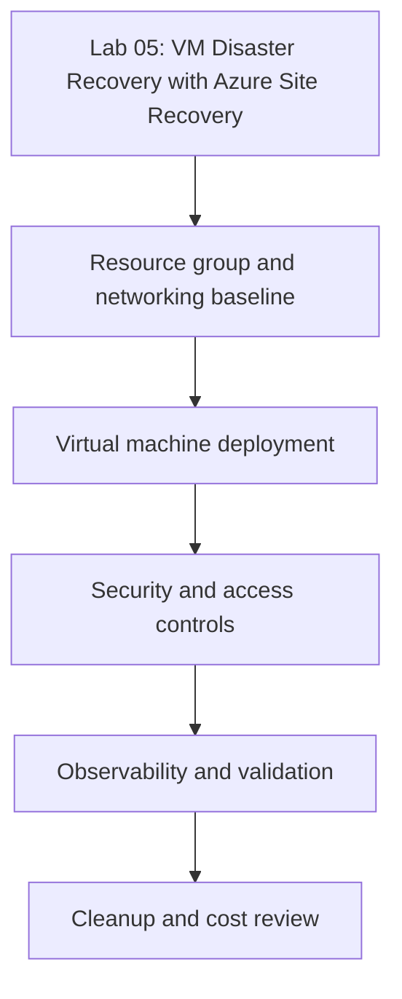

---
content_sources:
  diagrams:
  - id: tutorials-lab-guides-lab-05-vm-disaster-recovery-asr-architecture-diagram
    type: flowchart
    source: mslearn-adapted
    description: Architecture Diagram
    based_on:
    - https://learn.microsoft.com/en-us/azure/virtual-machines/
    - https://learn.microsoft.com/en-us/cli/azure/vm
    - https://learn.microsoft.com/en-us/azure/backup/backup-azure-vms-introduction
    - https://learn.microsoft.com/en-us/azure/site-recovery/azure-to-azure-tutorial-enable-replication
validation:
  az_cli:
    last_tested: null
    cli_version: null
    result: not_tested
  bicep:
    last_tested: null
    result: not_tested
---

# Lab 05: VM Disaster Recovery with Azure Site Recovery

Configure Azure Site Recovery for a critical VM, run a test failover, and document the validation artifacts needed for a real DR event.

## Prerequisites

- Azure subscription with contributor-level access to compute, network, backup, and monitoring resources
- Azure CLI installed and signed in
- Variables set for the lab:
    - `RG`
    - `VM_NAME`
    - `LOCATION`
    - `VNET_NAME`
    - `SUBNET_NAME`
- A Log Analytics workspace or backup vault where the lab requires it

## Architecture Diagram

<!-- diagram-id: tutorials-lab-guides-lab-05-vm-disaster-recovery-asr-architecture-diagram -->


## Lab Metadata

| Field | Value |
|---|---|
| Lab file | `lab-05-vm-disaster-recovery-asr.md` |
| Estimated duration | 45-75 minutes |
| Difficulty | Intermediate |
| Focus technologies | Azure Site Recovery, replication, failover drills |
| Cost profile | Moderate; deallocate or clean up immediately after validation |

## Step-by-step Instructions

### Step 1: Create the resource group and network baseline

```bash
az group create \
    --name $RG \
    --location $LOCATION \
    --output json

az network vnet create \
    --resource-group $RG \
    --name $VNET_NAME \
    --address-prefixes 10.40.0.0/16 \
    --subnet-name $SUBNET_NAME \
    --subnet-prefixes 10.40.1.0/24 \
    --output json
```

| Element | Purpose |
|---|---|
| `$RG` | Resource group containing the VM resources. |
| `$LOCATION` | Azure region for regional resource discovery or creation. |
| `$VNET_NAME` | Virtual network used by the VM workload. |
| `$SUBNET_NAME` | Subnet used by the VM workload. |
| `--name` | Identifies the resource being created, read, updated, or deleted. |
| `--location` | Selects the Azure region for regional resources or SKU lookup. |
| `--output` | Controls the output format for logs, scripts, or human review. |
| `--resource-group` | Scopes the command to the intended resource group. |
| `--address-prefixes` | Azure CLI option used to scope or shape the operation. |
| `--subnet-name` | Azure CLI option used to scope or shape the operation. |
| `--subnet-prefixes` | Azure CLI option used to scope or shape the operation. |
| Expected result | Command succeeds and returns the requested Azure resource state or operation result. |

Expected outcome:

- The resource group exists in the intended region.
- The virtual network and subnet are available for VM deployment.

### Step 2: Deploy the base VM

```bash
az vm create \
    --resource-group $RG \
    --name $VM_NAME \
    --image Ubuntu2204 \
    --size Standard_D4s_v5 \
    --admin-username azureuser \
    --generate-ssh-keys \
    --vnet-name $VNET_NAME \
    --subnet $SUBNET_NAME \
    --public-ip-sku Standard \
    --storage-sku Premium_LRS \
    --output json
```

| Element | Purpose |
|---|---|
| `$RG` | Resource group containing the VM resources. |
| `$VM_NAME` | Target virtual machine name. |
| `$VNET_NAME` | Virtual network used by the VM workload. |
| `$SUBNET_NAME` | Subnet used by the VM workload. |
| `--resource-group` | Scopes the command to the intended resource group. |
| `--name` | Identifies the resource being created, read, updated, or deleted. |
| `--image` | Selects the marketplace image for the VM OS. |
| `--size` | Selects CPU, memory, disk, and network capacity envelope. |
| `--admin-username` | Configures the initial administrative account. |
| `--generate-ssh-keys` | Creates or reuses SSH keys for Linux VM access. |
| `--vnet-name` | Places the VM NIC in the specified virtual network. |
| `--subnet` | Places the VM NIC in the specified subnet. |
| Expected result | Command succeeds and returns the requested Azure resource state or operation result. |

Expected outcome:

- The VM deploys with Premium SSD-backed storage and a predictable network baseline.
- You have enough CPU, memory, and NIC capability to test the scenario without using a tiny burstable SKU.

### Step 3: Inspect replication and recovery readiness

This lab records the recovery evidence needed before treating Site Recovery configuration as production-ready.

```bash
az backup item list \
    --resource-group $RG \
    --vault-name $VAULT_NAME \
    --backup-management-type AzureIaasVM \
    --output table

az backup job list \
    --resource-group $RG \
    --vault-name $VAULT_NAME \
    --output table
```

| Element | Purpose |
|---|---|
| `$RG` | Resource group containing the VM resources. |
| `$VAULT_NAME` | Recovery Services vault used for VM backup. |
| `--resource-group` | Scopes the command to the intended resource group. |
| `--vault-name` | Azure CLI option used to scope or shape the operation. |
| `--backup-management-type` | Azure CLI option used to scope or shape the operation. |
| `--output` | Controls the output format for logs, scripts, or human review. |
| Expected result | Command succeeds and returns the requested Azure resource state or operation result. |

Recommended operator notes:

- Capture the command output in your lab log.
- Record prerequisites unique to the target region, vault, or security policy.
- If the feature depends on another Azure service, confirm that dependency before continuing.
### Step 4: Validate the scenario end to end

Run both control-plane and workload validation so the result is useful during a real incident or audit.

```bash
az vm get-instance-view \
    --resource-group $RG \
    --name $VM_NAME \
    --output json

az monitor activity-log list \
    --resource-group $RG \
    --offset 2h \
    --output table
```

| Element | Purpose |
|---|---|
| `$RG` | Resource group containing the VM resources. |
| `$VM_NAME` | Target virtual machine name. |
| `--resource-group` | Scopes the command to the intended resource group. |
| `--name` | Identifies the resource being created, read, updated, or deleted. |
| `--output` | Controls the output format for logs, scripts, or human review. |
| `--offset` | Controls the activity log lookback window. |
| Expected result | Command succeeds and returns the requested Azure resource state or operation result. |

### Step 5: Optional operational hardening

- Review whether the lab design should also use accelerated networking or proximity placement groups.
- Review whether JIT access, ASGs, and backup retention should be part of the same deployment workflow.
- Review whether Reserved Instances, Spot, or auto-shutdown affect the scenario economics.

## Validation Steps

Use the following validation checklist before marking the lab complete:

- [ ] The VM is in the expected power and provisioning state
- [ ] The intended feature change is visible in Azure resource properties
- [ ] At least one CLI verification command was captured after the change
- [ ] You can explain how the lab outcome would change production design or troubleshooting

## Cleanup Instructions

```bash
az vm delete \
    --resource-group $RG \
    --name $VM_NAME \
    --yes

az network nic delete \
    --resource-group $RG \
    --name "${VM_NAME}VMNic"

az group delete \
    --name $RG \
    --yes \
    --no-wait
```

| Element | Purpose |
|---|---|
| `$RG` | Resource group containing the VM resources. |
| `$VM_NAME` | Target virtual machine name. |
| `--resource-group` | Scopes the command to the intended resource group. |
| `--name` | Identifies the resource being created, read, updated, or deleted. |
| `--yes` | Confirms a destructive command without an interactive prompt. |
| `--no-wait` | Starts the operation and returns before Azure completes it. |
| Expected result | Command succeeds and returns the requested Azure resource state or operation result. |

Cleanup notes:

- Delete associated disks, public IPs, Bastion hosts, vault items, or replication resources if the lab created them.
- Review whether backup vaults or recovery services still hold retained items that continue billing after VM deletion.

## See Also

- [Best Practices](../../best-practices/index.md)
- [Operations](../../operations/index.md)
- [Troubleshooting Playbooks](../../troubleshooting/playbooks/index.md)

## Sources

- [Azure virtual machines documentation](https://learn.microsoft.com/en-us/azure/virtual-machines/)
- [Azure CLI for virtual machines](https://learn.microsoft.com/en-us/cli/azure/vm)
- [Azure Backup for virtual machines](https://learn.microsoft.com/en-us/azure/backup/backup-azure-vms-introduction)
- [Azure Site Recovery for Azure VMs](https://learn.microsoft.com/en-us/azure/site-recovery/azure-to-azure-tutorial-enable-replication)
